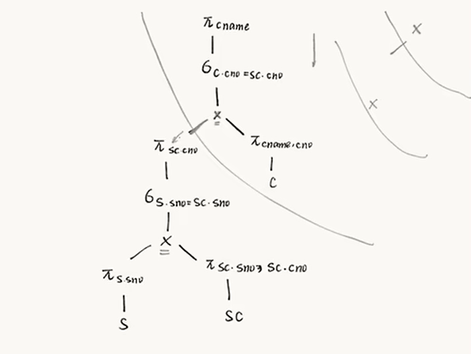
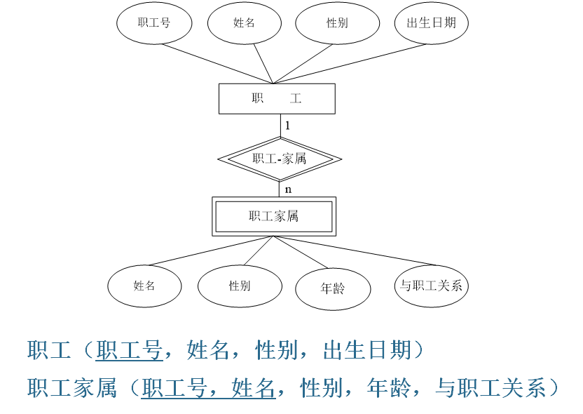

# 数据库1复习课

## 第一章 数据库发展史

数据、信息和知识

现实世界-> 信息世界-> 计算机世界

- 数据管理
  - 人工管理阶段
  - 文件系统阶段
  - 数据库系统阶段
  
- 数据库技术
  - 三级模式
  - 二级映象与数据独立性
  
- 数据库体系结构

- DBMS 数据库管理系统

- 数据库系统结构的分类

  ---------------

介绍自从有计算机以来数据管理技术的发展阶段：

- 人工管理阶段
- 文件系统阶段
- 倒排文件系统阶段
- 数据库阶段以及数据库的发展趋势

### 1.1 数据库管理技术的发展

#### 1.1.1 人工管理阶段

在此阶段，计算机主要进行科学计算，外部存储器只有磁带、卡片和纸带等，软件只有汇编语言，数据处理方式基本上是批处理

特点：

- 数据不保存在计算机中
- 没有专门的软件对数据进行管理。存储结构改变时，应用程序必须改变
- 只有程序的概念，没有文件的概念
- 数据面向程序。即一组程序面向一个程序

#### 1.1.2 文件系统阶段

这一阶段，计算机不仅用于科学计算，还用于信息管理。外部存储器已有磁盘、磁鼓等直接存取存储设备，软件领域也出现了高级语言和操作系统。

特点：

- 数据以“文件”形式长期保存在外部存储器的磁盘上。可以对文件进行大量的查询、修改等操作
- 数据的逻辑结构和物理结构有了区别。程序只需关心文件名就可以与数据打交道
- 文件组织已多样化。有索引文件、链接文件和直接存取文件等，但文件之间相互独立、缺乏联系
- 数据不再属于某个特定的程序，可以重复使用，即数据面向应用。但文件结构设计任然是基于特定的用途
- 对数据的操作以记录为单位。这是由于文件中只存储数据，不存储文件记录的结构描述信息

缺陷：（如p4举的部门电话号码的例子）

- 数据冗余
- 不一致性
- 数据联系弱

#### 1.1.3 倒排文件系统阶段

倒排文件对每个字段都提供单独的索引，这就使用户不仅能用关键码，还能按字段的任何组合较容易地检索记录。倒排文件系统是由每个关键字的列表组成的，列表中的每个条目指向一个包含该关键字的文档或记录，因此同一个关键字可能出现在多个列表中。

倒排文件系统可以通过将搜索查询中的所有关键字映射到其相应的列表，并取它们的交集来快速定位到匹配的文档或记录。倒排文件系统被广泛用于搜索引擎中，很适合信息检索系统

但，其存储是相当昂贵的，因为这些索引可能比数据占有更多的存储空间

### 1.2 数据库技术的产生和发展

IMS系统：Information Management System

DBTG报告: Data Base Task Group，这份报告对数据库和数据操作的环境建立了标准的规范

E.F.Codd的文章：“A Relation Model of Date for Large Shared Date Banks”第一次提出了关系模型的文章，这篇文章奠定了关系数据库的理论基础，使关系数据库从一开始就建立在集合论和谓语演算的基础上。关系数据库语言是属于**非过程性语言**。

#### 1.2.1 数据库阶段的特点

这个阶段的程序和数据的联系通过数据管理系统（DBMS）实现

五大特点：

- 采取数据模型表示复杂的数据结构
- 有较高的数据独立性
- 数据库系统为用户提供了方便的用户接口
- 数据库系统提供了多个数据控制功能

- 增强了系统的灵活性性

文件系统阶段，程序设计处于主导地位，数据只起着服从程序设计需要的作用

数据库方式下，数据占据了中心位置，数据结果的设计成为信息系统首先关心的问题

#### 1.2.2 数据库技术的术语

DB: Database 数据库，长期存储在计算机中，有组织的、统一管理的相关数据的集合。

DBMS: 数据库管理系统，位于用户和OS之间的一层数据管理软件，为用户或应用程序提供访问DB的方法。DBMS总是基于某种数据结构，可以分为层次型、网状型、关系型和面向对象型

数据库技术: 研究数据库的结构、存储、设计、管理和使用的一门软件学科

BDS: Database System 实现有组织地、动态地存储大量关联数据，即它是采用数据库技术的计算机系统

#### 1.2.3 数据库技术的发展

层次型、网状型、关系型三大数据库系统

##### 1.2.3.1 什么是分布式以及新的发展

分布式（Distributed）是指将一个系统或应用程序**分散在多个不同的计算机或节点上**，这些计算机或节点通过网络连接相互通信和协作，以完成共同的任务或实现某个目标。相对于集中式（Centralized）系统，分布式系统具有更高的可靠性、可扩展性和容错性，因为它可以在多个节点上同时执行任务，不会因为单点故障导致整个系统崩溃。

在分布式系统中，各个节点之间通过通信协议进行信息交换，共同协作完成任务。每个节点可能扮演不同的角色，如计算节点、存储节点、控制节点等。节点之间可以采用不同的通信方式，如消息传递、共享内存、远程过程调用等，以实现数据和控制的传递。分布式系统也需要考虑一些特殊的问题，如一致性、可靠性、安全性、负载均衡等。

分布式系统被广泛应用于许多领域，如分布式数据库、分布式计算、分布式存储、分布式消息队列、分布式日志等，它们都是由多个节点协同工作来完成相应的任务或服务。近年来，随着云计算和大数据技术的兴起，分布式系统变得越来越普遍，并成为许多企业和组织实现高可用性、高性能和大规模服务的必备技术。

- 分布式数据库技术：数据库技术与网络技术相结合的产物
- 面向对象数据库技术：面向对象程序设计技术与数据库技术结合的产物

## 第二章 数据库系统结构

数据描述

- 概念设计中的
- 逻辑设计中的
- 物理设计中的
- 数据联系的描述

数据模型

数据库的体系结构

---------

### 2.1 数据描述

在数据处理中，从事物的特性到计算机中的具体表示，经历了一下三个阶段：概念设计中的数据描述、逻辑设计中的数据描述、物理存储介质中的数据描述

#### 2.1.1 概念设计中的数据描述

数据库中的概念设计是根据用户的需求设计数据库的概念结构

- 实体Enity: 客观存在、可以相互区别的事物。实体可以是具体的对象（一名女同学），也可以是抽象的对象（一次借书）
- 实体集Enity Set: 性质相同的同类实体的集合（如所有的男同学、所有飞机）
- 属性Attribute: 实体有很多特性，每一个特性成为属性，每个属性有一个值域
- 字体表示符Identifier: 能唯一标识实体的属性或属性集，也被称为关键码（key）或键（如学生的学号可以作为学生实体的标识符）

#### 2.1.2 逻辑设计中的数据描述

根据概念设计得到的概念结构来设计的数据库逻辑结构

- 字段（Field）:标记实体属性的命名单位，或称为数据项，是可以命名的**最小信息单位**，又可以称为数据元素/初等项。字段名往往和属性名相同

- 记录(Record): 字段的有序集合。一般，用一个记录描述一个实体，所以记录又可以定义为能为完整地描述一个实体的字段集

- 文件File：用一类记录的集合（如所有的学生记录组成了一个学生文件）

- 关键码/键key：能唯一确定文件中每个记录的字段或字段集

  实体——记录

  字段——属性

  文件——实体集

  实体表示符——关键码

数据描述有两种形式：物理描述和逻辑描述

- 物理描述：数据在存储设备上的存储方式的描述，物理数据是实际存放在存储设备上的数据
- 逻辑数据描述是程序员或用户以操作的数据形式的描述，是抽象的概念化数据

#### 2.1.3 存储介质层次及数据描述

物理存储中的数据描述

位、字节、字（计算机位数）、块、桶、卷

#### 2.1.4 数据联系的描述

联系(Relationship)：实体之间的相互关系。联系的元数：实体集之间联系的个数

- 一元联系

- 二元联系

  

- 三元联系等

  

### 2.2 数据模型

模型是对现实世界的抽象。能表示实体类型及实体间联系的模型称为数据模型Data Model

- 概念数据模型：一种独立于计算机系统的数据类型，完全不关心信息在计算机中的表达
  - 实体联系模型

- 逻辑数据模型（结构数据模型）：面向数据库的逻辑结构，是对现实世界的第二层抽象。包含数据结构、数据操作和数据完整性约束三部分

  数据结构：对实体类型和实体间联系的表达和实现

  数据操作：对数据库的检索和更新两类操作

  数据完整性约束：给出数据以及其联系应具有的制约和依赖规则

  - 层次型
  - 网状型
  - 关系型
  - 面向对象型

#### 2.2.1 实体联系模型（Entity Relationship Model）

简称ER模型，直接从现实世界中抽象出实体类型以及实体间联系，然后用实体联系图（ER图）表示数据类型

ER图四种组成部分：

- 矩形框：表示实体类型（问题的对象）
- 菱形框：表示联系类型（实体间的联系）
- 椭圆形框：表示实体类型或联系类型之间的**属性**。对于主键的属性，在属性名下画一条横线
- 连线：实体与属性、联系与属性之间，并在横线上标注联系的类型（1:1, 1:m, m:n)

#### 2.2.2 层次模型以及网络模型

- 层次模型：用树形（层次）结构表示实体类型以及实体间联系的数据类型。上一层记录类型和下一层之间的联系是1：n联系，所以只能表示1：n联系。层次模型的特点是记录之间的联系通过指针来实现

  

- 网状模型：用有向图结构表示实体类型及实体间联系的数据模型，箭头表示从箭尾到箭头的记录类型间的联系是1：n联系

层次实际上是一种特别的网状模型

#### 2.2.3 关系模型

Relational Model，主要特征是用二维表格表达实体集。关系模型由若干个关系模式组成的集合，每个关系实际上就是一个二维表格

关系模型中基本的数据结构就是表格，记录之间的联系通过模式的键体现

SQL语言是**关系数据库**的代表性语言

#### 2.2.4 面向对象模型

- 对象（Object）
- 类（Class）

一个类可以从类层次的直接或间接祖先哪里继承所有的属性和方法，用这种方法实现软件的可重用性

### 2.3 数据库体系结构

#### 2.3.1 三级模式结构

- 外部级

- 概念级

- 内部级

  

从某个角度看到的数据特性，称为数据视图

- 外模式：单个用户使用的数据视图的描述
  - 用户用到的那部分数据的描述
- 概念模式（模式）：全局数据视图的描述
  - 是数据库中全部数据的整体逻辑结构的描述
- 内模式：物理存储数据视图的描述
  - 数据库在物理存储方面的描述

两个层次的映像：DBMS为了实现三个抽象级别的联系和转换

- 外模式/模式映像：放在外模式中描述
- 模式/内模式映像：放在内模式中描述

#### 2.3.2 两级数据独立性

数据独立性是指应用程序和数据库的数据结构之间相互独立，不受影响。两个独立性的实现都是对映像进行修改

- 物理数据独立性
- 逻辑数据独立性

DDL：数据定义语言

DML：数据描述语言

### 2.4 数据库管理系统DBMS

数据库系统中对数据进行管理的软件系统，是数据库系统DBS的核心组成部分

三级结构定义存放在数据字典中

5大主要功能：

- 数据库定义功能：DBMS提供DDL定义数据库的三层结构、两级映像，定义数据的完整性约束、保密限制等约束

- 数据操纵功能：基本的数据操作有两类

  - 检索（查询）
  - 更新（插入、删除、更新）

  DML又可以分为过程DML和非过程DML

  - 过程：既需要指出做什么也需要指出怎么做
  - 非过程：只要指出怎么做，关系型DML就属于非过程性语言

- 数据库的保护功能
- 数据库维护功能
- 数据字典（Data Dictionary, DD）

DBMS的模块组成：

- 查询处理器
- 存储管理器

### 2.5 数据库系统

DBS(采用了数据技术的计算机系统)包括：

- 数据库DB

- 硬件

- 软件，包括DBMS、OS等

- 数据库管理员DBA

  DBS的全局结构：

DBS结构的分类：

- 集中式
- 客户机/服务器式
- 并行式
- 分布式

## 第三章 关系代数

用二维表格表示实体集

外键

关系：对应二维表格

元组：表中的行

属性：表中的列

域：属性的取值范围

关系代数语言

传统：交、并、差、笛卡尔积

专门的关系运算：选择、投影、联结、除法。

关系代数表达式：关系代数运算的有限次复合。可以用关系代数表达式表示对数据库的各种**查询**

-----

### 3.1 关系数据模型

关系运算是关系数据库模型的理论基础

笛卡尔积：两个域之间所有的组合关系

- 关系（表）可以看成是由行和列交叉组成的二维表格，表示一个实体集合

- 表中一行称为一个元组，可以用来表示实体集中的一个实体

- 列的取值范围称为域。属性的个数又称为元数

- 表中任意两行（元祖）不能相同，能唯一识别表中不同行的属性或属性组称为主键

  **关系是一种规范化了的二维表格**

- 外键：若一个关系R中包含有另一个关系S的主键所对应的属性组F，则称F为R的外键。并称关系S为参照关系，关系R是依赖关系。**在关系型数据库中，表与表之间的联系就是通过公共属性实现的**，这个公共属性是一个表的主键和另一个表的外键。在主键属性下面加上下划线，在外键的属性下面加波浪线

关系模型基本上遵循数据库的三级体系结构。在关系模型中，概念模式是关系模式的集合，外模式是关系子模式的集合，内模式是存储模式的集合

关系模型的完整性规则：

- 实体完整性规则

- 参照完整性规则

- 用户定义的完整性规则

  其中实体完整性规则和参照完整性规则是关系模型必须满足的完整性的约束条件

### 3.2 关系代数

关系代数语言：查询操作时以集合操作为基础的运算

#### 3.2.1 关系代数的五大基本操作

- 并Union R∪S

  将两个关系合并成一个关系。要求两个关系具有相同的元数（个数一样且种类也一样的属性个数），还要求运算的结果消除重复的元组，所以并之后还是相同属性下的关系

- 差Difference R-S

  也是要求属性相同，结果是属于一个而不属于另一个的元组的集合

- 笛卡尔积Cartesian Product R*S

  设关系R和关系S的元数分别是r和s，定义R和S的笛卡尔积R*S是一个（r+s）元的元祖集合。每个元祖的前r个分量（属性值）来自R的一个元祖，后s个分量是S的一个元组

  若R有m个元组，S有n个元组，则笛卡尔积之后的结果有m*n个元组

- 投影Projection

  这个操作是对一个关系进行垂直分割，消去某些列，指定留下某些列，并重新安排列的顺序，再删去重复的行。括号里面的是表名，外面要的是要保留的列

- 选择Selection

  根据某些条件进行水平分割，即选择符合条件的元组。括号里面是表名，括号外面加选择条件

  

  

#### 3.2.2 关系代数的组合操作

- 交Intersection RVS

  和前面的并和差有点像，要求两个关系有相同的属性，要求既属于R又属于S

- 联结Join

  笛卡尔积和选择的组合。当运算是=等号时，联结操作称为等值联结

- 自然联结Natural Join

  是一种特殊的等值联结，要求两个关系中有相同的属性，然后把重复的项去除

- 除Division R÷S，除法在计算全部使用之类的题目确实好用

  要求R中同时都满足S的，最终结果是去除S属性的R中的剩余属性的结果

  

#### 3.2.3 扩充的关系代数操作

为了在关系代数操作中，多保留一些信息，就引入了“外联结”和“外部并”

- 外联结，联结之后保留一部分数据。左外就是多保留左边的，右外就是多保留右边的，外联结就是两边都多保留，加上空值null
- 外部并，两个属性不相同的也能进行并，加上空值null
- 半联结，联结之后再选择

### 3.3 查询优化

- 关系代数表达式
- 语法树
- 优化树

关系代数表达式的等价变换规则

语法树：叶子是关系，非叶子结点是关系代数操作

优化后的语法树

一些规则：

- 在由关系代数转化为原始的语法树的时候，联结/自然联结是无法在语法树中表示的，所以要转化为笛卡尔积和选择
- 下移，语法树的执行时从下往上执行的

[B站学姐视频](https://www.bilibili.com/video/BV1Fp4y1a7Cs/?spm_id_from=333.337.search-card.all.click&vd_source=8118f92da6fddd1314c7a349e5a58084)

最后分组的话就在笛卡尔积的左下方画一条虚线

## 第四章 结构化查询语言SQL

- SQL的特点

  - 集数据查询、数据操纵、数据定义和数据控制功能于一体

  - 非过程语言

- 常见的关系型数据库和非关系型数据库

- SQL的组成

  - 数据定义
  - 数据操纵

- SQL数据库的体系结构

  一个表可以是一个基本表，也可以是一个视图

- 建表

- 数据的查询

  from->where->group->having->select->order

- 除法、聚合函数、分组、集合操作

- 数据更新、视图、修改、删除、插入

------

SQL: Structured Query Language 结构化查询语句，一种介于关系代数和关系演算之间的语言，功能：查询、操纵、定义、控制，是关系数据库领域中的一种主流语言

### 4.1 SQL概述

SQL数据库的体系结构基本上也是三级模式结构：

- 外模式->视图
- 模式->基本表
  - 一个表table是行row的集合，每行是列column的序列，每列对应一个数据项。元组称为行，属性称为列
- 内模式->存储文件

一个表可以是基本表，也可以是视图。基本表示实际存储在数据库中的表。视图是从基本表或其他视图导出的表，它本身不独立存储在数据库中，也就是数据库中只存放视图的定义而不存放视图的数据，这些数据仍存放在导出视图的基本表中，所以视图是虚表

SQL主要分为以下四个部分：

- 数据定义：SQL DDL，用于定义SQL模式、基本表、视图和索引
- 数据操纵：SQL DML，分为数据查询和数据更新（插入、删除、修改）两类
- 数据控制：SQL DCL，对基本表和视图的授权、完整性规则的描述、事务控制语句等
- 嵌入式SQL的使用：SQL语句嵌入在宿主语言程序中的使用规则

#### 4.2 SQL的数据定义DDL

SQL模式（Schema，其实就是数据库Database）、基本表（关系、table）、视图（view）、索引（index）的创建和撤销

用了外键约束之后，加了外键约束的是子表，另外一个是父表。先创建父表，再创建子表。删表的时候，先删子，再删父。插入数据的时候，先插入父，再插入子。

## 第六章 实体联系模型

属性：基本属性（单值）、复合属性、多值属性和导出属性

联系：联系的元数、联系的类型、联系的基数

实体

- 弱实体
- 子类和超类

ER模型设计步骤

ER模型到关系模型的转换

--------

ER模型的基本元素：实体、联系、属性

- 矩形框：表示实体类型（问题的对象），将实体、实体集、实体类型等统称为实体。ER模型提到的实体往往指实体集
- 菱形框：表示联系类型（实体间的联系）。联系是实体之间的一种行为，一般为动词
- 椭圆形框：表示实体类型或联系类型之间的**属性**。对于主键的属性，在属性名下画一条横线
- 连线：实体与属性、联系与属性之间，并在横线上标注联系的类型（1:1, 1:m, m:n)

### 6.1 属性的分类

根据属性的**类别**分：

- 基本属性：不可再分割的属性，如性别、年龄
- 复合属性：可以再分解为其他属性的属性（即属性可嵌套），如地址属性可再分割。复合属性可形成一个属性的层次结构

根据属性的**取值特点**：

- 单值属性：指同一实体的属性只能取一个值。如同一个学生只能具有一个年龄
- 多值属性：同一实体的某些属性可能多个值。如一个人的学位是一个多值属性。**多值属性用双椭圆形表示**
  - 需要对多值属性进行变换：
    - 增加几个新的属性，将原来的多值属性用几个新的属性来表示
    - 增加一个新的实体，这个新的实体和原来的实体之间是1：n联系，这个新的实体依赖于原实体而存在，称为**弱实体**

**导出属性**：通过相互依赖的属性推导而产生的属性。如一个人的出生年份可由年龄推导出来。导出属性用虚形椭圆加虚线与实体相连

**空值**：当实体的某个属性上没有值时使用空值（Null）

- 值无意义，占位空值
- 值尚不明确，未知空值
- 未知结果

### 6.2 联系的设计

- 联系的元数/度数：一个联系涉及到的实体集的个数

  - 一元联系（递归连续）：同一个实体集内部实体之间的联系

  - 二元联系：两个不同实体集实体之间的联系

    

  - 三元联系：三个不同实体集实体之间的联系

    

- 联系的连通词：联系涉及到的实体集之间实体对应的方式

  - 1:1
  - 1:N
  - M:N
  - M:1

  对于联系“构成”的属性“数量”的语义要清楚，如某一产品组成时需要某种零件的数目

- 联系的基数：有两个基数E1和E2，E1中每个实体与E2中有联系的数目的最小值Min和最大值Max称为E1的基数，用(Min, Max)表示

### 6.3 ER模型转化为关系模型

### 6.4 ER模型的扩充

#### 6.4.1 依赖类和弱实体

- 依赖联系：一个实体的存在必须以另一个实体的存在为前提

- 弱实体：一个实体对于另一个实体具有很强的依赖联系，而且该实体的主键部分或全部从其父实体中获得，称该实体为弱实体。弱实体用**双线矩形框**，与父实体之间的联系用**双线菱形**表示，线也用双线（只是弱实体这边用双线）

  
  
  

#### 6.4.2 子类和超类

人员比教师、学生更为**抽象、泛化**，教师、学生比人员更为**具体、细化**

当较低层上实体类型表达了与之联系的较高层上的实体类型的特殊情况时，就称高层上实体类型为**超类型**，较低层上实体类型为**子类型**

- 子类与超类之间具有继承性，即子类实体继承超类实体的所有属性。但子类实体本身还可以包含比超类实体更多的属性
- 这种继承性是通过子类实体和超类实体有相同的实体标识符实现的。如，身份证号，人员有，学生、教师也继承有

带有子类的实体类型（即超类）以两端双线的矩形框表示，并用加圈的弧线与其子类相连

## 题型

选择

判断

填空

应用

简答

综合

**书上的小细节**