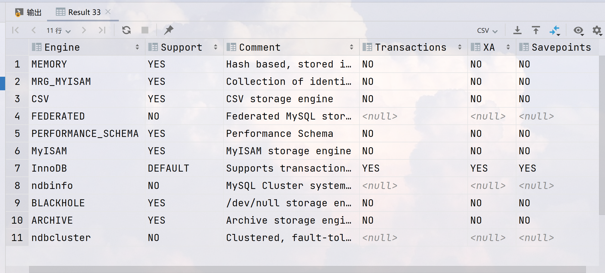
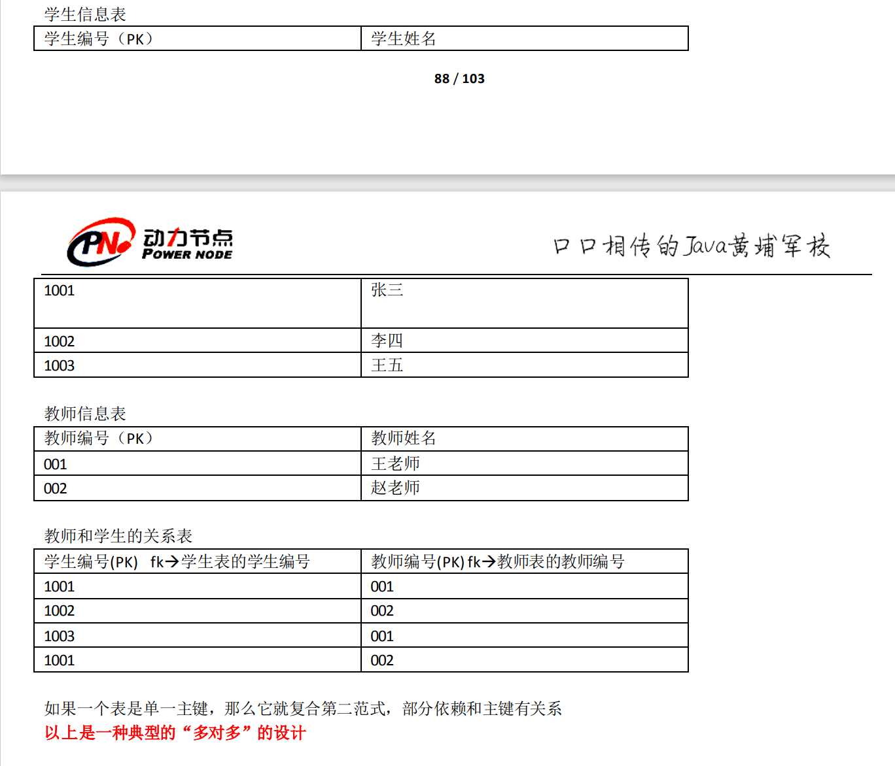

# 老杜的MySQL课程

“一步一步地写”

## 0 SQL和MySQL的一些知识

### 0.1 关于SQL语句的分类

SQL，Structured Query Language，结构化查询语言。是一种特定目的的编程语言，用于管理关系数据库管理系统（RDBMS），或在关系流数据管理系统(RDSMS)中进行流处理。

SQL语句有很多，可以进行5种分类

- DQL：数据**查询**语言（凡是带有select关键字的都是查询语句）select ...

- DML：数据操作语言（凡是对表当中的数据进行增删改的都是DML)

  - insert 增

  - delete 删

  - update 改

    **主要针对的是表中的数据**

- DDL：数据定义语言（凡是带有create、drop、alter的都是DDL

  - DDL主要操作的是表的结构，不是表中的数据

  - create：新建，等同于增

  - alter：修改

  - drop：删除

    **这个增删改和DML不同，这个主要对表结构进行操作**

- TCL：是事务控制语言

  - 事务提交：commit;
  - 事务回滚：roolback;

- DCL：数据控制语言

  - 如授权grant、撤销权限revoke

### 0.2windows上启动和关闭mysql服务

- net stop 服务名称（net stop MySQL)

- net start 服务名称（net start MySQL)

- 其他服务也可以这么启动/停止服务，此电脑->管理->服务和应用程序->服务->(即可展开windows下的服务)


### 0.3 客户端如何登录mysql数据库

- 本地登录（显示编写密码的形式）：mysql -uroot -p+密码      （我的MySQL的登录密码是：123456）

- 本地登录（隐藏密码的形式）：mysql -uroot -p(直接回车)

- 进入mysql，mysql是一个数据库管理系统


### 0.4 mysql的常用命令以及一些注意事项

所以命令后面都要加英文分号。

- 退出mysql：exit

- 查看mysql中有哪些数据库：show databases;（要以英文分号结尾，mysql默认自带了四个数据库）

- 选择使用某个数据库：use +数据库的名称（information_schema/mysql/performance_schema/test）;

- 创建数据库：create database +数据库名称；

- 删除/撤销数据库：drop database +数据库名称;

- 查看某个数据库下有哪些表： show tables;

- 将.sql文件中的数据导入数据库中：source +文件路径\文件名（mysql> source D:\AStudy\classthree\DataBase\document\bjpowernode.sql）

- 查看表中的数据：select * from 表名；//*表示所有的意思，从这个表中查询所有的数据

- 不看表中的数据，只看表中的结构：desc 表名；（**describe**）

- 查看mysql数据库的版本号：select version();

- 查看当前所用的数据库：select database();

- **查询去除重复数据：select distinct 字段名 from 表名;** 

  - distinct 只能出现在所有字段的最前面，可以多个字段联合起来去除重复记录。
  - 例：select count(distinct job) from emp;
  
  ***以上的命令不分大小写***
  
  ***注意：mysql不见分号不执行，分号表示结束，/c可以用来终止一条sql命令***
  
  ***另外SQL语句不区分大小写，都行***
  
  ***在所有的数据库中，字符串统一用单引号括起来，单引号是标准，双引号在oracle数据库中使用不了，但在mysql中可以使用***
  
  ***在数据库中的null代表什么都没有，，它不是一个值，所以不能使用等号进行衡量***
  
  **数据库中有一条命名规范：**所有的标识符都是全部小写，单词和单词之间使用下换线衔接

### 0.5 数据库当中最基本的单元——表（table)

数据库当中以表格的形式来表示数据，因为表比较直观，任何表都有行（row，被称为数据/记录)和列（column,被称为**字段**)

| 姓名 | 性别 | 年龄 |
| ---- | ---- | ---- |
| 张三 | 男   | 18   |
| 李四 | 女   | 20   |

这就是一张表：

- 行（row):被称为**数据/记录**。
- 列（column):被称为**字段**。性别字段、姓名字段、年龄字段。每个字段下的数据都有数据类型、字段名、约束等属性。
  - 数据类型：字符串、数字、日期等
  - 约束：约束有很多种，其中一个叫做唯一性约束，这种约束添加之后，该字段中的数据不能重复。

- MySQL最初是一套关系型数据库管理系统。后由Oracle负责维护运营。


### 0.6 DB、DBMS以及其他

- **DB**：数据库。是文件

- **DBMS**：数据库管理系统，是一种针对对象数据库，为管理数据库而设计的大型电脑软件管理系统。具有代表性的数据管理系统有：Oracle、Microsoft SQL Server、Access、MySQL及PostgreSQL等。通常数据库管理师会使用数据库管理系统来创建数据库系统。现代DBMS使用不同的数据库模型追踪实体、属性和关系。在个人电脑、大型计算机和主机上应用最广泛的数据库管理系统是关系型DBMS（relational DBMS）。在关系型数据库中，用二维表格表示数据库中的数据。这些表格称为关系。

  简单说来DBMS其实就是一个软件，通过SQL语句来管理DB数据库。通过SQL语句来对数据库来进行增删改查操作。MySQL就是一种数据库管理系统。

- **xxxx.sql** ：这种文件被称为sql脚本文件。sql脚本文件中编写了大量的sql语句。我们执行sql脚本文件的时候，该文件中所有的sql语句会全部执行！批量的执行SQL语句，可以使用sql脚本文件。
  在mysql当中怎么执行sql脚本呢？
  			mysql> source D:\course\03-MySQL\document\vip.sql（文件的绝对路径）
  在实际的工作中，第一天到了公司，项目经理会给你一个xxx.sql文件，你执行这个脚本文件，你电脑上的数据库数据就有了！

 ### 0.7 用例


## 1. DQL数据查询语言简单查询（凡是带有select关键字的都是查询语句）

### 1.1简单语句查询(选择字段名进行查看)

- 查询一个字段：select 字段名 from 表名；
-  查询两个字段或者多个字段：使用“，”隔开 select 字段名1,字段名2,字段名3 from 表名；
- 查询所有字段
  - select  * from 表名（使用这种方法的缺点是效率低、可读性差。在实际开发中不建议使用，可以在DOS命令窗口中想快速看一看权表数据可以采用这种方法）
  - 可以把所有的字段名都写上

- 给查询的列起别名:select 字段名 as 别名 from 表名；（使用as关键字起别名，as是单独修饰效果。只是将显示的查询结果列名显示，原表列名是不变的。**select语句是永远都不会进行修改操作的，只负责查询**）as关键字可以省略（假如起别名的时候，别名里面有空格，DBMS看到这样的语句，进行SQL语句的编译，不符合语法，编译报错。可以用***单引号\双引号***将别名括起来）

- 计算年薪之类的：字段可以使用数学表达式，此时列里面的数据可以参与运算。

### 1.2 复杂语句查询（进行条件查看）

- 条件查询:不是将表中所有的数据都查出来，而是将符合条件的数据查询出来
- 语法格式：select 字段1，字段2，字段3 from 表名 **where** 条件；

  - 等于：=
  - 不等于:**<>** /  **!=**
  - 小于：<
  - 小于等于：<=
  - 大于：>
  - 大于等于：>=
  - 两个值之间：between ... and ...  / 字段名 >= ... and 字段名 <= ...(**使用between and 的时候，必须左小右大的方式，其为闭区间**)
  - is null 为空；is not null 不为空
  - 并且：and（**and和or同时出现的时候，and的优先级较高，想要先执行or，那就加括号**）
    -  select * from emp where sal > 2500 and deptno = 10 or deptno = 20;以上语句先执行and, 然后执行or。and的优先级较高。这个语句的含义是先找出工资为2500的员工并且部门编号为10的，或者部门编号为20的员工给找出来。可以通过加括号来实现原本想实现的内容。
  - 或者：or
  - 包含：in（**in就相当于or的用法，in后面跟的是具体的值**）
    - select empno,ename,job from emp where job in ('manager', 'salesman');
  - 不在这几个中的其他：not in 
  - 模糊查询 like
    - 支持%或下划线匹配
    - %匹配任意个字符
    - 下划线，一个下划线只匹配一个字符，任意一个字符
    - （%是个特殊的字符，_也是一个特殊的符号）
    - **注意：**找含有下划线‘_’的，需要使用**转义字符**\，写成 like '%\_%'
    - select * from emp where ename like '%T';

### 1.3 排序

- 排序：select 列名(可以多个列名) from 表名 order by 列名；（默认是升序）
- 指定**降序**：select 列名(可以多个列名) from 表名 order by 列名 desc;
- 指定升序：select 列名(可以多个列名) from 表名 order by 列名 asc;
- 多个字段排序（如果一个字段一样的情况下，再按照另外一个字段名进行排序）：select 字段名 from 表名 order by 字段名 asc/desc， 字段名 asc/desc;(当然前面一个字段名起主导作用)
- 根据字段的位置进行排序：select 字段名 from 表名 order by 数字; (这个数字表示列数，如2表示第二列) （但不建议在开发中使用，因为不健壮。因为列的顺序很容易发生改变，列顺序修改之后，列数就废了）

### 1.4 综合案例（既有条件查询又有排序）

找出工资在1250到3000之间的员工信息，要求按照薪资降序排列：

- select ename, sal from emp where sal between 1250 and 3000 order by sal desc;

  **注意**：关键字的顺序不能变

  select ...

  form ...

  where...

  order by ...; **order by 是最后的**

### 1.5 数据处理函数

数据处理函数又被称为单行处理函数。

- 单行数据函数的特点是一个输入对应一个输出，函数是一行一行的执行的。

- 和单行处理函数相对的是：多行处理函数(多个输入，对应1个输出，可以对一整个列进行处理

- 常见的单行处理函数：

  - lower 转换小写  lower(str);

  - upper 转换大写 upper(str);

  - substr 取子串（substr(被截取的字符串，起始下标，截取的长度)） **注意：**起始下标是从1开始的，没有0

    - **将首字母进行小写操作：select concat(lower(substr(ename, 1, 1)), substr(ename, 2, length(ename))) from emp;**

  - length 取长度 length(str);

  - trim 去空格 trim(str);

  - str_to_date 将字符串转化为日期

  - date_format 格式化日期

  - format 设置千分位

  - case... when ...then... when... then... else .. end

    - 当员工的工作岗位是MANAGER的时候，工资上调10%，当工作岗位是SALESMAN的时候，工资上调50%（注意此时认识不修改数据库，而是将查询结果显示为工资上调）

    - ```
      select ename, job, sal, 
      (case job when 'MANAGER' then sal*1.1 when 'SALESMAN' then sal*1.5 else sal end) as new_sal 
      from emp;
      ```
    
  - round 四舍五入

    - select 字段/字面值 from 表名；**所以select 的后面可以跟某个表的字段名，也可以直接跟字面量/字面值（数据）**

    - ```
      select round(12345.111, 0) from emp; #后面的0表示四舍五入保留的小数的位数为0，所以这个数字代表四舍五入最后的小数点的位数；负数代表往前推，比如当为-1时，结果是12340
      ```
  
  - rand() 生成随机数

    - 100以内的随机数生成：round(rand()*100, 0);
    - 其本身生成的小数是小于1的，大于0的；
  
  - ifull 可以将null转换成一个具体的值

    - ifnull：是空处理函数，专门用来处理NULL。

    - 在所有数据库当中，只要有NULL参与的数学运算，最终的结果都是NULL。

    - 为了避免以上现象，需要使用ifnull函数

    - ifnull用法：ifnull(数据，被当做的值)；

    - ```
      select ename, ifnull(comm, 0) from emp;
      ```
  
  - concat函数：字符串拼接用的 

    - 用法：concat(str1, str2);

### 1.6 分组函数（多行处理函数）

多行处理函数特点：输入多行，最终输出一行

总共有5个：

- count 计数
- sum 求和
- avg 平均值
- max 最大值
- min 最小值

**注意：**分组函数在使用的时候必须先进行分组，然后才能使用。如果没有进行分组的话，整张表默认是一组。

找出最高工资：select max(sal) from emp; 

剩下的几个函数也是这样的格式。

注意：

- 分组函数自动忽略NULL，不需要提前对NULL进行处理。（NULL什么也不是）
- count(具体字段) 和 count(*) 的区别：
  - count(具体字段)：表示统计该字段下所有不为NULL的元素的总数
  - count(*)：代表着整张表的行记录，统计整张表有效的行数。也即是统计表中的总行数（只要有一行数据 count 就++）**因为每一行记录不可能都为NULL，一行数据中有一列不为NULL，则这行数据就是有效的**

- **分组函数不能直接使用在where子句中**

  如一下语句，找出大于平均工资的sal 和 ename

  ```sql
  select ename, sal from emp where sal > avg(sal);
  ```

  这个语句就会进行报错。

- 所有的分组函数可以组合起来一起使用

```sql
select count(ename), max(sal), min(sal), avg(sal), sum(sal) from emp;
```

### 1.7 分组查询 group by（**重要**）

- 什么是分组查询：

  在实际的应用中，有的时候可能需要先进行分组，然后对每一组的数据进行操作。这个时候就会用到分组查询。

  例如：计算每个工作岗位的平均薪资；计算每个部门的工资和；找出每个工作岗位的最高薪资...

- ```sql
  select ...
  from ...
  group by ...
  ```

- ```sql
  select ...
  from ...
  where ...
  group by ...
  order by ...
  #以上关键字的顺序不能颠倒
  #执行顺序是：1.from 2.where 3.group by 4.select 5.order by
  #普通语句没写group by，并不代表着没有，而是代表着默认整张表，也是有执行的。分组函数必须在分组之后才能使用。
  ```

- 例：

  ```sql
  select avg(sal), job, count(ename) from emp group by job; 
  #按照工作种类分组来查看平均工资、每个工作的人数以及各个工作的名称
  #如果要使用到 group by 的时候，那么select 后的语句跟分组的字段，以及分组函数，别的会报错而且没有意义。select 后不能随意加。
  ```

- 找出每个部门，不同工作岗位的最高薪资？

   技巧：两个字段联合成1个字段看

  ```sql
  select DEPTNO, JOB, max(sal) from emp group by DEPTNO, JOB order by DEPTNO;
  ```

- 使用having可以对分完组后的数据进一步过滤。having不能单独使用，having 不能代替where，having必须和group by 联合使用

  ```sql
  select deptno, max(sal) from emp group by deptno having max(sal) >= 3000 order by max(sal) desc;
  ```

  或者可以使用where先进行筛选，然后再分组

  ```sql
  select deptno, max(sal) from emp where sal >= 3000 group by deptno order by DEPTNO desc;
  ```

  **优化策略：where 和 having ，优先选择where，where 实在完成不了的，再选择having**

  - where 完成不了的

    例如：找出每个部门平均薪资，要求显示平均薪资高于2500的

  - where 后面不能使用分组函数

### 1.8 小总结（单表的查询）

```sql
select ...
from ...
where ...
group by ...
having ...
order by ...
```

**以上这个顺序只能这样，不能颠倒**

执行顺序：1. from 2. where 3. group by 4. having 5. select 6. order by

从某张表中查询数据

先经过where条件筛选出有价值的数据

对这些有价值的数据进行分组

分组之后可以使用 having 进行继续筛选

select 查询出来

最后排序输出

```sql
#例 要求显示每个岗位的平均薪资，要求显示平均薪资大于1500的，除manager之外，要求按照平均薪资降序排列
select job, avg(sal) from emp where job != 'MANAGER' group by job having avg(sal) > 1500 order by avg(sal) desc;
select job, avg(sal) from emp where job <> 'MANAGER' group by job having avg(sal) > 1500 order by avg(sal) desc;
```

### 1.9 连接查询（最重要）

- 什么是连接查询：
  - 从一个表中进行查询是单表查询
  - empt 表和 dept 表联合起来进行查询数据，从 empt 表中去员工名字，从 dept 表中去部门名字。这种跨表查询，多张表联合起来查询数据，被称为连接查询

- 连接查询的分类

  - 根据语法年代分类：

    - SQL92：1992年的时候出现的语法；

    - SQL99：1999年的时候出现的语法；

      这里重点学习的是SQL99

  - 根据表连接的方式进行分类：
    - 内连接：**完成能够匹配上这个条件的数据查询出来**
      - 等值连接
      - 非等值连接
      - 自连接
    - 外连接：是分主次的查询，两张表有一个是主表
      - 左外连接（左连接）
      - 右外连接（右连接）
    - 全连接（这里不进行介绍）：两张表都是主表的用法

- 当两张表连接没有任何条件限制时，最终查询结果条数是两张表条数的乘积，这种现象被称为**笛卡尔积现象**，这是一种数学现象。笛卡尔积现象也说明了查询时候的底层原理

  - 如何避免笛卡尔积现象：连接时加条件，满足这个条件的记录被筛选出来。

    ```sql
    select ename, emp.deptno, loc, dname from emp, dept where emp.deptno = dept.deptno;
    ```

    这个语句最终查询的结果是14条。但在匹配的过程中，匹配的次数仍然是两张表条数的乘积，只不过进行了四选一。

    ```sql
    #可以给表起别名
    select ename, e.deptno, loc, dname from emp e, dept d where e.deptno = d.deptno;#这是SQL92语法
    ```

  - 连接查询的时候可以给表起别名
  
  - **注意：**通过笛卡尔积现象得出，表的连接次数越多效率越低，尽量避免表的连接次数。

- 内连接之等值连接：条件是一个等值关系

  - 实例：查询每个员工所在部门名称，显示员工名和部门名。

     emp e 和 dept d表进行连接，条件是：e.deptno = d.deptno

    ```sql
    #sql92 的语法
    select e.ename, d.dname from emp e, dept d where e.deptno = d.deptno;
    #sql99 语法 join ... on ...
    select e.ename, d.dname from emp e inner join dept d on e.deptno = d.deptno;#inner 可以省略（带着inner可读性更好！一眼就能看出来是内连接）条件是等量关系，所以被称为等值连接
    ```

    sql92语句的缺点：结构不清晰，表的连接条件，和后期进一步筛选的条件，都放到了where后面

    sql99的优点：表连接的条件是独立的，连接之后，如果还需要进一步的条件筛选，再往后添加where条件语句。

    ```sql
    select ...
    from ...
    join ...
    on ...
    ```

    **简单来说：就是sql92语法将表连接和where条件混合在了一起，而sql99语句中 join ... on ... 是属于表连接的部分的，这就实现了表连接和where条件的分开**

    数据库管理员：DatabaseAdministrator

- 内连接之非等值连接：条件不是一个等值关系

  - 案例：找出每个员工的薪资等级，要求显示员工名、薪资、薪资等级

    ```sql
    select e.sal, e.ename, s.grade from emp e join salgrade s on e.sal between s.losal and hisal order by e.sal asc;
    ```

- 内连接之自连接：将一张表看成两张表处理

  - 实例：查询员工的上级领导，要求显示员工名和对应的领导名

    技巧：将一张表看成两张表

    ```sql
    select e1.ename as '员工名', e2.ename as '领导名', e1.mgr from emp e1 join emp e2 on e1.mgr = e2.empno;
    #13个数据，没用KING
    ```

- 外连接：

  ```sql
  select e.ename, d.deptno, d.dname  from emp e right outer join dept d on e.deptno = d.deptno;
  ```

  - right 表示将 join 关键字右边的这张表看成主表，主要是将这张表的数据全部查询出来，捎带着关联查询左边表。带有 right 的是右外连接，又叫右连接

  - left 表示将 join 关键字右边的这张表看成主表，主要是将这张表的数据全部查询出来，捎带着关联查询左边表。带有 left 的是左外连接，又叫左连接

  - 在外连接当中，两张表连接，产生了主次关系。而内连接两张表示平等的，两个表没有主次关系，如果内连接没有匹配出来那么就不显示出来。

  - outer 代表着外连接，可以省略

  - 外连接的查询结果条数一定是大于等于内连接的查询结果条数

  - 实例：查询每个员工的上机领导，要求显示所有员工的名字和领导名：

    ```sql
    select e1.ename, e2.ename, e1.mgr from emp e1 left outer join emp e2 on e1.mgr = e2.empno;
    ```

- 三张表或者以上的表连接

  ```sql
  #语法：
  select ...
  from a
  join b
  on a和b的连接条件
  join c
  on a和c的连接条件
  ```

  **一条SQL语句中内连接和外连接可以混合，都可以出现！**

  - 案例：找出每个员工的部门名称以及工资等级，要求显示员工名、部门名、薪资、薪资等级

    ```sql
    select e.ename, e.deptno, d.dname, s.grade from emp e join dept d on e.deptno = d.deptno join salgrade s on e.sal between s.losal and s.hisal order by sal asc;
    ```

    ```
    select e.ename, e.deptno, e.mgr, e.sal, d.dname, s.grade, e2.ename from emp e join dept d on e.deptno = d.deptno join salgrade s on e.sal between s.losal and s.hisal left join emp e2 on e.mgr = e2.empno order by e.sal asc;
    ```

### 1.10 子查询

- 什么是子查询：select 语句中嵌套着 select 语句，被嵌套的 select 语句被称为子查询

- 子查询都可以出现在哪里

  ```sql
  select ...(select)
  from ...(select)
  where ...(select)
  ```

- where 子句中的子查询

  - 案例：找出比最低工资高的员工姓名和工资

    ```sql
    select sal, ename from emp where emp.sal >
                          (select min(sal) from emp)
    order by sal asc;
    ```

- from 子句中的子查询

  - **注意：from 后面的子查询，可以将子查询的查询结果当做一张临时表来使用**

  - 案例：找出每个岗位的平均工资的薪资等级

    **用到了group by 来先计算每个岗位的平均工资，然后把得到的这个当做一个表，这个过程要克服心理障碍，把查询的结果当做一个真实存在的表，然后与另外一个表进行表连接**

    ```sql
    select
    a.job, a.sal, s.GRADE 
    from
    (select job ,avg(sal) as sal from emp group by job) a 
    join salgrade s 
    on a.sal between s.LOSAL and s.HISAL 
    order by a.sal asc;
    ```

- select 后面出现的子查询（了解）

  - 找出每个员工的部门名称，要求显示员工名，部门名

    ```sql
    select e.ename, e.deptno, (select d.dname from dept d where e.deptno = d.deptno) from emp e;
    ```

  - **注意：**要求select 后的子查询，这个子查询一次只能返回一个结果，多于一个结果就会出错

### 1.11 union 合并查询结果集

- ```sql
  (select ename, job from emp where job in ('MANAGER')) union (select ename, job from emp where job in ('SALESMAN'));
  ```

- union 的效果要高一点。对于表连接来说，没连接一次新表，则匹配的次数满足笛卡尔积，成倍地翻；但 union 可以减少匹配的次数，在较少匹配的次数的情况下，还可以完成两个结果集的拼接。union 把乘变成了加法

- **注意事项：**

  - union 在进行结果合并的时候，要求两个结果集的列数相同
  - 两个列的结果集数据类型不同的时候，在MySQL里面可以运行;但在 oracle 中语法严格，不可以，会报错的，要求合并时列和列的数据类型一样。

### 1.12 limit 将查询结果集的一部分取出来

- 通常用在分页查询中（比如像搜索引擎通常选择一页中显示一定的信息，这样分页可以提高用户的体验）

- ```sql
  select ename, sal from emp order by sal asc limit 5;
  #取前5条数据
  ```

- 用法:
  - limit startIndex, length;   startIndex 是起始下标，length 是长度，其实下标从0开始
  - 缺省用法：limit number; 如：limit 5； 这是去前5条数据

- **注意：**mysql 当中 limit 是在 order by 之后执行的！

### 1.13 通用分页

- 公式：pageNo, pageSize

  startIndex = (pageNo - 1) * pageSize

  select ... limit startIndex, pageSize

### 1.14 distinct 去除重复数据

**查询去除重复数据：select distinct 字段名 from 表名;** 

- distinct 只能出现在所有字段的最前面，可以多个字段联合起来去除重复记录。
- 例：select count(distinct job) from emp;

### 1.15 DQL语句执行顺序

```sql
1.from
2.where
3.group by
4.having
5.select
6.order by
7.limit ...
```

## 2 表的创建和修改（DML数据操作语言和DDL数据定义语言）

### 2.1 表的创建（建表）

- 建表的语法格式（建表属于DDL 数据定义语句，DDL包括：create drop alter)：create table 表名（字段1 数据类型，字段2 数据类型，字段3 数据类型）；

  ```sql
  create table 表名(
      字段1 数据类型，
      字段2 数据类型，
      字段3 数据类型
  );
  ```

​        表名：建议以t_或者tbl_开始，可读性强，见名知意

​		字段名：见名知意

​		表名和字段名都属于标识符

#### 2.1.1 关于 MySQL的数据类型

有很多的数据类型，下面仅列举一些

- varchar（最长255）

  - 可变长度的字符串，可以根据传来的数据长度来动态地分配空间。比较智能，节省空间
  - 优点：节省空间。所以如名字这种可变长度的字段，优先选择 varchar
  - 缺点：需要动态的分配空间，所以速度比较慢

- char（最长255）

  - 定长字符串
  - 不管实际的数据长度是多少，分配固定长度的空间去存储数据。使用不恰当的时候，可能会导致空间的浪费。
  - 优点：不需要动态分配空间，速度快。所以固定长度的字段就优先选择char
  - 缺点：使用不当可能会导致空间的浪费

- int （最长11）

  - 数字中的整型

- bigint

  - 数字中的长整型，相当于java中的 long

- float

  - 单精度浮点型数据

- double

  - 双精度浮点型数据

- date

  - 短日期类型

- datetime

  - 长日期类型

- clob

  - Character Large Object

  - 字符大对象，最多可以存储4G的字符串
  - 比如存储一篇文章，存储一个说明
  - 超过255个字符的都要采用CLOB字符大对象来存储

- blob

  - 二进制大对象
  - Binary Large Object
  - 专门用来存储图片、声音、视频等流媒体数据
  - 往BLOB类型的字段上插入数据的时候，例如插入一个图片、视频等，需要使用IO流

- 电影院表举例说明各个数据类型

​	t_movie 电影表（专门用来存储电影信息）

| no(bigint) | name(varchar) | description(clob) | playtime(date) | time(doulbe) | image(blog) | type(char(1)) |
| ---------- | ------------- | ----------------- | -------------- | ------------ | ----------- | ------------- |
|            |               |                   |                |              |             |               |

创建学生表

学号、姓名、姓名、邮箱

```sql
create table t_student(
    no int,
    name varchar(9),
    age int(3),
    email varchar(255)
);
```

#### 2.1.2 快速创建（复制）表

快速创建表其实就是将表进行复制

原理：将一个查询结果当做一张表新建，这个可以完成表的快速复。表创建出来，同时表中的数据也存在了。也可以将查询结果创建成一个新的表

create table 新表名 as select * from 已经存在的表名;

```sql
create table emp2 as select * from emp;
select * from emp2;
drop table emp2;
create table emp3 as select ename, sal from emp;
select * from emp3;
drop table emp3;
```

### 2.2 删除表

```sql
drop table 表名；//当这张表不存在的时候，这个语句会报错
//如果这张表存在的话就删除
drop table if exists 表名;
```

### 2.3 Insert（DML语言） 语句

```sql
#语法格式
insert into 表名(字段名1，字段名2，字段名3...) values(值1，值2，值3)
```

**注意：**字段名和值要一一对应。即数量要对应，数据类型要对应

```sql
insert into t_student(no, name, age, email) values(1, '张三', 20, 'zhangsan@123');
insert into t_student values(2, '李四', 20, 'lisi@123');
insert into t_student(name, email, no, age) values('王二', 'wanger@123', 3, 21);
```

**注意：**Insert 语句但凡是执行成功了，那么必然会多一条记录。没有给其他字段指定值的话，默认值是NULL。未指定字段，按照默认顺序赋值，即Insert 字段中的字段名可以省略，前面的字段名都省略的话，就要值都得写上，还要按照顺序。也可以在字段中指定顺序，依次给字段赋值。

- 还可以使用 default指定默认值：

  ```sql
  create table t_student(
      no int,
      name varchar(20),
      sex char(1) default 'm',
      age int,
      email varchar(20)
  );
  ```

#### 2.3.1 Insert 插入日期

- format：数字格式化千分位

  format(数字，'格式')

  如：select ename, format(sal, '$999,999') as sal from emp;

- str_to_date：将字符串varchar类型转换成date类型

  str_to_date('字符串日期','日期格式’)将字符串类型的日期转换为date类型的日期

  ```sql
  insert into t_user(id, name, birth, save_time) values(1, 'zhangsan', '1990-10-1', str_to_date('2000-10-1', '%Y-%m-%d'));
  ```

  - 其通常运用在插入insert 方面，因为插入的时候需要一个日期类型的数据，需要通过该函数将字符串转换成date
  - 如果提供的日期字符串是：%Y-%m-%d这种格式的话，就不用使用str_to_date函数了。因为当写成这种格式的时候，会进行自动转换

- date_format：这个函数可以将日期类型转换成特定格式的字符串展示

  - date_format(日期数据类型，'日期格式')
  - 通常使用在查询日期方面，设置展示的日期格式
  - MySQL默认的日期格式：'%Y-%m-%d'

  ```sql
  select id, name, date_format(save_time, '%d-%m-%Y') from t_user;
  ```

- 像一些字段名，既可以使用date日期类型，又可以使用字符串数据类型

- MySQL的日期格式：
  - %Y 年
  - %m 月
  - %d 日
  - %h 时
  - %i 分 
  - %s 秒

- Java 中的日期格式：yyyy-MM-dd HH:mm:ss SSS

#### 2.3.2 date 和 datetime 的区别

date：是短日期，只包括年月日信息

- MySQL 短日期默认格式：%Y-%m-%d

datatime：是长日期，包括年月日时分秒信息 

- %Y-%m-%d %h:%i%s

  ```sql
  insert into t_user(id, name, birth, save_time) values(1, 'zhangsan', '1990-10-1', '2000-10-10 12:12:12');
  ```

- MySQL中获取当前时间的函数 now()，并且获取的时间带有时分秒，是datetime格式

  ```sql
  insert into t_user(id, name, birth, save_time) values(2, 'lisi', '2002-10-1', now());
  ```

#### 2.3.3 将查询结果插入到一张表中

就是从select 查询的结果插入到表中，但是要字段要匹配。这个方法并不常用。

```sql
create table emp4 as select * from emp;
select * from emp4;
insert into emp4 select * from emp;
```

#### 2.3.4 insert 插入多条语句

insert 一次可以插入多条语句

语法：insert into 表名(字段名1，字段名2，...) values(),(),()...;

```sql
insert into t_user(id, name, birth, create_time) values
(1, 'zhangsan', '2000-1-1', now()),
(2, 'lisi', '2001-2-2', now()),
(3, 'wanger', '2002-3-3', now());
```

### 2.4 修改 update（DML语句）

语法格式：update 表名 set 字段名1=值1，字段名2=值2，字段名3=值3... where 条件;

**注意：**没有条件限制会导致所有数据都更新

```sql
update t_user set name = 'wanger',birth='2000-1-1', save_time=now() where id = 2;
```

### 2.5 删除数据

#### 2.51 删除数据 delete

语法格式：delete from 表名 where 条件;

删除原理：表中的数据被删除了，但这个数据在硬盘上的真实存储空间不会被释放。属于DML操作

这种删除的优点：支持回滚，后悔了可以再回复数据

缺点：删除的效率比较低

**注意：**没有条件，整张表都会被删除

```sql
delete from t_user where id = 2;
delete from t_user;
```

#### 2.5.2 快速删除表里的数据 truncate

原理：这种删除效率比较高，表被一次截断，物理删除。属于DDL操作，没有条件选择

缺点：不支持回滚

优点：快速

语法：truncate table表名；

```sql
truncate table emp4;
```

大表非常大，有的时候上亿条数据，使用delete也许会执行1个小时才能删除完，效率很低。这个时候可以选择使用truncate删除表中的数据，只需要不到1秒就结束，效率很高

### 2.6 对表结构的增删改（alter)

对表结构的增删改就是添加一个字段，删除一个字段，修改一个字段等

- 在实际开发中，需求一旦确定之后，表一旦涉及好之后，很少地修改表的结构，对应的Java代码就需要进行大量的修改。成本会比较高，这个责任应该由表的设计者负责

- 由于修改表结构的操作很少，视频课程中很少介绍。而且如果需要修改表的结构，可以使用可视化工具。

- 修改表结构的操作不需要写到Java程序中，实际上也不是Java程序员的范畴。

  对表结构的修改需要使用：alter 属于DDL语句 来增加、删除、修改表的结构

  DDL包括：create drop alter

- 添加字段：

  - alter 表名 add 字段名 字段数据类型

  - 如：需求发生改变，需要向 t_student 中加入联系电话字段，字段名称为：contatct_tel 类型为 varchar(40) 

  alter table t_student add contact_tel varchar(40)

- 修改字段：

  - 如：student_name 无法满足需求，长度需要更改为 100 alter table t_student modify student_name varchar(100) 

  - 如 sex 字段名称感觉不好，想用 gender 那么就需要更爱列的名称

    alter table t_student change sex gender char(2) not null;

- 删除字段：

  - 如：删除联系电话字段 

    alter table t_student drop contact_tel;

## 3 表的完善(实用、优化、开发)

### 3.1 约束

约束：constraint

在创建表的时候可以给表中的字段加上一些约束，来保证这个表中数据的完整性、有效性。约束的作用就是为了保证表中的数据有效。

常见的约束：

a) 非空约束，not null 

b) 唯一约束，unique 0

c) 主键约束，primary key (PK)

d) 外键约束，foreign key (FK)

e) 自定义检查约束，check（不建议使用）(在 mysql 中现在还不支持，Oracle支持）

#### 3.1.1 非空约束not null

非空约束not null 约束的字段不能为NULL

not null 只有列级约束，没有表级约束

```sql
create table t_vip(
    id int,
    name varchar(255) not null
);
```

#### 3.1.2 唯一性约束 unique

唯一性约束unique约束的字段不能重复，但是可以为NULL。

```sql
create table t_vip(
    id int unique,
    name varchar(255) unique,
    email varchar(255) unique
);
insert into t_vip(id, name, email) values
(1, 'zhangsan', 'zhangsan@1234'),
(2, 'lisi', 'lisi@1234');
insert into t_vip(id) values
(4),
(5);
```

数据插入的时候重复就会报错

- 新需求：name 和 email 两个字段联合起来具有唯一性

  ```sql
  create table t_vip(
      id int,
      name varchar(255),
      email varchar(255),
      unique(name, email)
  );
  insert into t_vip(id, name, email) values
  (1, 'zhangsan', 'zhangsan@1234'),
  (2, 'wanger', 'wanger@sina.com'),
  (3, 'wanger', 'wanger@qq.com');
  ```

  语法：unique(字段1，字段2); 在insert 时声明

- 约束直接添加到列后面的，叫做列级约束

- 约束没有添加在列的后面的，这种约束叫做表级约束。需要给多个字段联合起来添加某一个约束的时候就使用表级约束。

- unique 可以和 not null 联合使用，这两个联合起来之后在MySQL中就变成了主键字段（oracle中不一样）

  ```sql
  create table t_vip(
      id int,
      name varchar(255),
      email varchar(255) unique not null
  );
  ```

#### 3.1.3 主键约束（primary key，简称PK，重要）

主键约束的相关术语：

- 主键约束：就是一种约束。

- 主键字段：该字段上添加了主键约束，这样的字段叫做：主键字段

- 主键值：主键字段中的每一个值都叫做：主键值。

主键值是每一行记录的唯一标识。主键值是每一行记录的身份证号！！！没有主键表无效！

主键的特征：not null + unique （主键值不能为NULL，同时不能重复）

```sql
create table t_vip(
    id int primary key,
    name varchar(255),
    email varchar(255)
);
```

- primary key 也可以用在表级约束，多个字段联合起来叫做联合主键，和前面的unique的效果差不多。联合主键的意思是多个字段联合形成一个主键

  ```sql
  create table t_vip(
      id int,
      name varchar(255),
      email varchar(255),
      primary key(name, email)
  );
  ```

  - 在实际开发中，不建议使用复合主键，建议使用单一主键。因为主键值存在的意义是这样记录的身份证号，只要达到意义即可。单一主键就能做到。

- primary key 用在列级约束，叫做单一主键

- **一张表，主键约束只能有一个**

- 主键值建议使用：

  - int
  - bigint
  - char
  - 等类型 不建议使用：varchar 来做主键。主键值一般都是数字，一般都是定长的！

- 主键除了单一主键和复合主键之外，还可以使用以下分类：

  - 自然主键

    主键值是一个自然数，和业务没关系。

  - 业务主键

    主键值和业务紧密关联，例如拿银行卡账号做主键值。这就是业务主键！

  - 自然主键使用比较多，因为主键只要做到不重复就行，不需要有意义。业务主键不好，因为主键一旦和业务挂钩，那么当业务发生变动的时候，可能会影响到主键值，所以业务主键不建议使用。尽量使用自然主键。

- 在MySQL当中，有一种机制，来自动维护一个主键值 primary key auto_increment

```sql
create table t_vip(
    id int primary key auto_increment,
    name varchar(255),
    email varchar(255)
);
insert into t_vip(name, email) values
('zhangsan', 'zhangsan@1234'),
('wanger', 'wanger@sina.com'),
('wanger', 'wanger@qq.com');
```

#### 3.1.4 外键约束（foreign key FK 重要）

外键约束：是一种约束

外键字段：该字段添加了一个外键约束

外键值：外键字段当中的每一个值

用了外键约束之后，加了外键约束的是子表，另外一个是父表。先创建父表，再创建子表。删表的时候，先删子，再删父。插入数据的时候，先插入父，再插入子。

```sql
drop table if exists t_class;
create table t_class(
    classno int primary key,
    classname varchar(255)
);
drop table if exists t_student;
create table t_student(
    no int primary key auto_increment,
    name varchar(255),
    cno int,
    foreign key(cno) references t_class(classno)
);
insert into t_class(classno, classname) values
(100, '上海中学高三四班'),
(101, '上海中学高三一班');
insert into t_student(name, cno) values
('zhangsan', 100),
('lisi', 100),
('wanger', 101),
('mazi', 101),
('wangwu', 100);
```

- 外键值可以为NULL
- 外键引用的字段不一定是主键，但至少有unique唯一性约束，要有唯一性

- foreign key(要约束的字段名) references 要引用字段的表名(要引用的字段名)

### 3.2 存储引擎

#### 3.2.1 什么是存储引擎

存储引擎是MySQL中特有的一个术语，其他数据库中没有。实际上存储引擎是一个表存储/组织数据的方式。不同的存储引擎，表存储数据的方式不同。

- 给表添加/指定存储引擎：

  - show create table  表名;

    ```
    CREATE TABLE `t_student` (
      `no` int NOT NULL AUTO_INCREMENT,
      `name` varchar(255) DEFAULT NULL,
      `cno` int DEFAULT NULL,
      PRIMARY KEY (`no`),
      KEY `cno` (`cno`),
      CONSTRAINT `t_student_ibfk_1` FOREIGN KEY (`cno`) REFERENCES `t_class` (`classno`)
    ) ENGINE=InnoDB AUTO_INCREMENT=9 DEFAULT CHARSET=utf8mb4 COLLATE=utf8mb4_0900_ai_ci
    ```

    可以在建表的时候在最后的小括号后面使用：

    - ENDING 指定存储引擎

    - CHARSET 指定这张表的字符编码方式

    - MySQL默认的存储引擎是：InnoDB

    - MySQL默认的字符编码方式是：utf8

      ```sql
      create table t_product(
          id int primary key,
          name varchar(255)
      ) engine = InnoDB default charset = gbk;
      show create table t_product;
      ```

#### 3.2.2 MySQL中常见的存储引擎

查看MySQL中常用的存储引擎语法：show engines;



- **MyISAM存储引擎**
  -  它管理的表具有以下特征：
     使用三个文件表示每个表：
      格式文件 — 存储表结构的定义（mytable.frm）
      数据文件 — 存储表行的内容（mytable.MYD）
      索引文件 — 存储表上索引（mytable.MYI）：索引是一本书的目录，缩小扫描范围，提高查询效率的一种机制。可被转换为压缩、只读表来节省空间
  - 对于一张表来说，只要是主键，或者加有unique约束的字段上会自动创建索引。
  - InnoDB 不支持事机制，安全性低

-  **InnoDB存储引擎**

  - 这是MySQL默认的存储引擎，同时也是一个重量级的存储引擎。InnoDB支持事务，支持数据库崩溃后自动恢复机制。
  - InnoDB最大的特点是：安全
  - 主要特点：
    - 每个 InnoDB 表在数据库目录中以.frm 格式文件表示 
    - InnoDB 表空间 tablespace 被用于存储表的内容 
    -  提供一组用来记录事务性活动的日志文件 
    - 用 COMMIT(提交)、SAVEPOINT 及 ROLLBACK(回滚)支持事务处理 
    -  提供全 ACID 兼容 
    - 在 MySQL 服务器崩溃后提供自动恢复 
    -  多版本（MVCC）和行级锁定
    -  支持外键及引用的完整性，包括级联删除和更新

  -  InnoDB最大的特点是支持事务：以保证数据的安全。效率不是很高，并且不能压缩，不能转换成只读，不能很好地节省存储空间。

- **MEMARY 存储引擎**

  - 使用 MEMORY 存储引擎的表，其数据存储在**内存**中，且行的长度固定，这两个特点使得 MEMORY 存储引擎非常快。 

  - MEMORY 存储引擎管理的表具有下列特征： 

    - 在数据库目录内，每个表均以.frm 格式的文件表示。
    -  表数据及索引被存储在内存中。

    - 表级锁机制。 

    - 不能包含 TEXT 或 BLOB 字段。

  - MEMORY 存储引擎以前被称为 HEAP 引擎。

  - MEMORY引擎优点：查询效率非常高

  - MEMORY引擎缺点：不安全，关机之后数据消失，因为数据和索引都存在内存当中。

### 3.3 事务（DML）

一个事务就是一个完整的业务逻辑。是一个最小的工作单元，不可再分。

什么是一个完整的业务逻辑？
		假设转账，从A账户向B账户中转账10000.
		将A账户的钱减去10000（update语句）
		将B账户的钱加上10000（update语句）
		这就是一个完整的业务逻辑。

以上的操作是一个最小的工作单元，要么同时成功，要么同时失败，不可再分。这两个update语句要求必须同时成功或者同时失败，这样才能保证钱是正确的。

只有DML语句才能有事务一说，其他语句和事务无关！

- insert 
- delete 
-  update 只有以上三个语句和事务有关，其他的都没关系。因为只有以上三个语句是数据库表中数据进行增删改的。只要操作一旦涉及到数据的增删改，那么就一定要考虑安全问题。**数据安全是第一位**

正式因为做某件事的时候，需要多条DML语句共同联合起来才能完成，所以需要事务的存在。如果任何一件复杂的事情都能用一条DML语句搞定，那么事务则没有存在的价值了。

**所以事务就是多条DML语句同时成功，或者同时失败**

#### 3.3.1 事务是怎么做到多条DML语句同时成果和失败

InnoDB存储引擎：提供了一组用来记录事务性活动的日志文件。

事务开始了：insert insert insert delete update update update 事务结束

在事务的执行过程中，每一条DML的操作都会记录到事务性活动的日志文件中。在事务的执行过程中，可以提交事务，也可以回滚事务。

- 提交事务：清空事务性活动的日志文件，将数据全部彻底持久化到数据库表中。提交事务标志着，事务的结束。并且是一种全部成功的结束。
- 回滚事务：将之前所有的DML操作全部撤销，并且清空事务性活动的日志文件回滚事务标志着，事务的结束。并且是一种全部失败的结束。

#### 3.3.2 提交事务和回滚事务

- 提交事务：commit；语句
- 回滚事务：rollback; 语句

事务：transaction

MySQL默认情况下是支持自动提交事务。自动提交事务就是每执行一条DML语句，则提交一次。这种自动提交实际上是不利于实际开发的，因为一个业务通常是需要多条DML语句共同完成的，为了保证数据的安全，必须要求同时成功之后再提交，所以不能执行一条就提交一次。

- 将MySQL中的自动提交关闭：start transaction
- 每次rollback 回滚都是回滚到上一次事务提交的节点

#### 3.3.3 事务的特性

四个特性

- A原子性：说明事务是最小的工作单元，不可再分
- C一致性：所有事务要求，在同一事务中，所有操作必须同时成功，或者同时失败，以保证数据的一致性
- I隔离性：A事务和B事务之间具有一定的隔离
- D持久性：事务最终结束的一个保障。事务提交，就相当于将没有保存到硬盘上的数据保存到硬盘上

#### 3.3.4 事务的隔离性

隔离级别，比如A教室和B教室中间有一道墙，这道墙可以很厚，也可以很薄这就是隔离级别。这道墙越厚，表示隔离级别就越高。

隔离级别有4个级别：

- 读未提交：read uncommited(最低)  没有提交就读到了
  - 事务A可以读取到事务B未提交的数据
  - 这种级别存在的问题就是脏读问题（Dirty Read），称为读到来脏数据。对方没有提交的数据称为脏数据
  - 这种隔离级别一般都是理论上的，大多数数据库隔离级别都是2级及以上
- 读已提交：read committed 提交了就读到了
  - 事务A只能读取到事务B已经提交的数据
  - 这种级别解决了脏读的现象
  - 问题：这种级别存在不可重复读取数据。在事务开启之后，第一次可能读到的是3条数据，可能等第二次再读取的时候，读到的是4条了，3不等于4就称为不可重复读取。
  - 这种隔离级别是比较真实的数据，第一次读到的数据是绝对的真实。
  - oracle数据库默认的隔离级别是：read committed
- 可重复读：repeatable read 提交之后也读不到，永远都是刚开启事务时的数据
  - 事务A开启之后，不管是多久，每次读取到的数据都是一致的。即使事务B将数据已经改变，并且提交了，事务A读取到的数据还是没有改变，这就是可重复读。
  - 可重复复读解决了不可重复读的问题
  - 缺点：可能会出现幻影读，每一次读到的数据都是假象。不够绝对的真实。
  - MySQL的默认隔离级别是 可重复读：repeatable read
- 序列化/串行化：serializable(最高隔离级别)
  - 这是最高隔离级别，效率最低，解决了所有的问题
  - **这种隔离级别表示事务排队，不能并发。只能有一个进行操作**。有点类似于线程同步，每次读取的数据都是最真实的，并且效率是最低的。

----

- 查看默认的隔离级别语句：select @@transaction_isolation;

- 修改隔离级别的语句：set [ global | session ] transaction isolation level Read uncommitted | Read committed | Repeatable | Serializable;

  - 如果选择global，意思是此语句将应用于之后的所有session，而当前已经存在的session不受影响。

  - 如果选择session，意思是此语句将应用于当前session内之后的所有事务。

  - 如果什么都不写，意思是此语句将应用于当前session内的下一个还未开始的事务。

### 3.4 索引（index）

#### 3.4.1 索引是什么

索引是在数据库表的字段上添加的，是为了提高查询效率存在的一种机制。一张表的一个字段可以添加一个索引，当然多个字段联合起来也可以添加索引。索引就相当于一本书的目录，是为了缩小扫描而存在的一种机制

对于一本字典来说，查找某个汉字有两种方式：

- 第一种方式：一页一页挨着找，直到找到为止，这种查找方式属于全字典扫描。效率比较低。

- 第二种方式：先通过目录（索引）去定位一个大概的位置，然后直接定位到这个位置，做局域性扫描，缩小扫描的范围，快速的查找。这种查找方式属于通过索引检索，效率较高。

MySQL查询数据方面主要就两种方式：

- 第一种：全表扫描
- 第二种：根据索引检索

在实际中，汉语字典前面的目录是排序的，按照a b c d e f g ...排序。之所以排序，就是为了区间查找（缩小扫描范围，其实就是为了只扫描某个区间）。在MySQL数据库中，索引也是需要排序的，并且这个索引的排序和TreeSet数据结构相同。TreeSet(TreeMap)底层是一个自平衡二叉树。在MySQL当中索引是一个B-Tree数据结构。

遵循左小右大原则存放，采用中序遍历方式遍历去数据。

#### 3.4.2 索引的实现原理

- 在任何数据库当中主键上都会自动添加索引对象，id字段上自动有索引，因为id是PK。另外在MySQL当中，一个字段如果有unique约束的话，也会自动创建索引。
- 在任何数据库中，任何一张表的任何一条记录在硬盘存储上都有一个硬盘的物理存储编号。
- 在mysql当中，索引是一个单独的对象，不同的存储引擎以不同的形式存在，在MyISAM存储引擎中，索引存储在一个.MYI文件中。在InnoDB存储引擎中索引存储在一个逻辑名称叫做tablespace的当中。在MEMORY存储引擎当中索引被存储在内存当中。不管索引存储在哪里，索引在mysql当中都是一个树的形式存在。（自平衡二叉树：B-Tree）


索引的实现原理就是缩小扫描的范围，避免全表扫描。表中的索引对象会通过树排序，最后通过硬盘上的物理存储编号直接定位找到目标

什么条件会给字段添加索引：

- 条件一：数据量庞大（到底有多么庞大，这个需要测试，因为每个硬件环境不同，具体问题具体分析）
- 条件二：该字段经常出现在 where 后面以条件存在，也就是说这个字段总是被扫描
- 条件三：该字段很少的DML操作（insert update delete）。因为DML之后，索引需要重新排序。

- 建议不要随意添加索引，因为索引也是需要维护的，太多的话反而会降低系统的性能。建议通过主键查询，通过unique约束的字段进行查询，效率还是很高的

#### 3.4.3 索引的创建与删除

```
#创建索引：
create index 索引名 on 表名(字段名);
create index emp_empno_index on emp(EMPNO);
#删除索引
drop index 索引名 on 索引所在的表名;
drop index emp_empno_index on emp;
#在MySQL中查看SQL语句是否使用了索引进行检索，explain语句。没有的话type = ALL
explain 查询语句
explain select * from emp where ENAME = 'King';
```

#### 3.4.4 索引失效

失效的时候

- 模糊查询的时候以'%'开始

  - ```sql
    explain select * from emp where ename like '%G';
    ```

  - 这个原因是模糊匹配当中以'%'开头了

- 使用 or 的时候会失效，如果使用了or 那么要求or两端的条件字段都要有索引，才能走索引。如果其中一边有一个字段没有索引，那么另一个字段上的索引也会实现。这也是不建议使用or的原因 。

  ```sql
  explain select * from emp where empno ='7369' or job = 'CLERK';
  ```

- 使用复合引擎的时候，没有使用左侧的列查找，索引失效，用左侧的就不会失效。复合索引就是两个字段或者更多的字段联合起来添加一个索引。**但在我的MySQL中没有失效，下面两个explain之后都使用了索引查询**

  ```sql
  create index index_empno_ename on emp(empno, ename);
  explain select * from emp where empno = '7369';
  explain select * from emp where ename = 'KING';
  ```

- 当where 当中索引列参加了运算，索引失效

  ```sql
  create index emp_sal_index on emp(sal);
  explain select * from emp where sal + 1 = 800;
  ```

- 当where 当中索引列中使用了函数

  ````sql
  explain select * from emp where lower(ename) = 'king';
  ````

#### 3.4.5 索引的分类

索引是各种数据库进行优化的重要手段。优化的时候优先考虑的就是索引。

索引在数据库当中分的类：

- 单一索引 在一个字段上添加索引
- 复合索引 在两个或更多的字段上添加索引


- 主键索引 主键上添加索引
- 唯一性索引 具有unique约束的字段上添加索引(唯一性比较弱的字段上添加索引用处不大)

### 3.5 视图

#### 3.5.1 视图对象的创建以及删除

视图view：站在不同的角度来对待同一份数据。

- 视图的创建

  create view 视图名称 as DQL语句；

  只有DQL语句才能以view的形式创建

  ```sql
  create view dept2_view as select * from dept2;
  ```

- 视图的删除

  drop view 视图名称；

  ```sql
  drop view dept2_view;
  ```

#### 3.5.2 视图能做些什么

就是方便，简化开发，利于维护

我们可以面向视图对象进行增删改查，对视图对象的增删改查，会导致原表被操作（视图的特点：通过对视图的操作，会影响到原表数据）

面向视图对象进行更改，对原表就行更改

视图用来简化SQL语句，将一段SQL数据看成一个视图。假设有一条复杂的SQL语句需要在不同的位置上反复使用。可以把这个SQL语句以视图对象的形式新建。在需要编写这条复杂SQL语句的位置直接使用视图对象，可以大大简化开发，并且利于后期维护。因为修改的时候也只需要一个位置就行，只需要修改视图所映射的SQL语句。

后面向视图开发的时候，使用视图的时候可以像使用table一样。可以对视图进行增删改查等操作。视图不是在内存当中，视图对象也是存储在硬盘上的，不会消失。视图也是文件，在数据库中也是以文件的形式存在的。

视图对应的语句只能是DQL语句。视图对象创建完成之后，可以对视图进行增删改查等操作。

- 增删改查，又叫做：CRUD。（CRUD是在公司中程序员之间沟通的术语。一般我们很少说增删改查，一般都说CRUD）
  - C:Create（增）
  - R:Retrive（查：检索）
  - U:Update（改）
  - D:Delete（删）

### 3.6 DBA 常用命令

数据导出：（在windows的dos命令窗口中）mysqldump 数据库名>目录\文件名.sql -uroot -p123456

mysqldump bjpowernode>D:\bjpowernode.sql -uroot -p123456

导出指定表：mysqldump bjpowernode emp>D:\bjpowernode.sql -uroot -p123456

数据导入：需要先登录到MySQL数据库服务器上；然后创建数据库：create database 数据库名；使用数据库：use 数据库名；然后初始化数据库：source 文件目录\文件名.sql（source D:\bjpowernode.sql）

### 3.7 数据库设计三范式（面试提问）

数据库表的设计依据。教你怎么进行数据库表的设计。

- 第一范式：要求任何一张表必须有主键，每一个字段原子性不可再分。

- 第二范式：建立在第一范式的基础之上，要求所有非主键字段完全依赖主键，不要产生部分依赖。

- 第三范式：建立在第二范式的基础之上，要求所有非主键字段直接依赖主键，不要产生传递依赖。

设计数据库表的时候，按照以上的范式进行，可以避免表中数据的冗余，空间的浪费。

#### 3.7.1 第一范式

最核心，最重要的范式，所有表的设计都需要满足。必须有主键，并且每一个字段都是原子性不可再分。


#### 3.7.2 第二范式

建立在第一范式的基础上，要求所有非主键字段必须完全依赖主键，不要产生部分依赖。

产生部分依赖的缺点：数据冗余，空间浪费

如：


使用多张表来实现多对多的关系。



多对多如何设计：**多对多，三张表，关系表两个外键**

#### 3.7.2 第三范式

第三范式建立在第二范式的基础上。要求所有非主键字段必须直接依赖主键，不要产生传递依赖。产生传递依赖就会产生数据冗余。

**口诀：**一对多，两张表，多的表加外键


#### 3.7.3 范式总结

**一对一口诀**：一对一，外键唯一

**多对多口诀**：多对多，三张表，关系表两个外键

**一对多口诀：**一对多，两张表，多的表加外键


数据库设计三范式是理论的，实际和理论有时候会有偏差的。

最终目的都是为了满足客户的需求，**有的时候会拿冗余换执行速度**。因为在SQL当中，表和表之间的连接次数越多，效率越低（笛卡尔积）。有的时候可能会有冗余，但是为了减少表的连接次数，这样做也是合理的，并且对于开发人员来说，SQL语句的编写难度也会降低

# 做题总结

## 1 查询相关

### 1.1 使用左连接右连接（查询两张表不同的数据）

有两张表：一张A表和一张B表

- left join(左联接) 返回包括左表中的所有记录和右表中联结字段相等的记录 ；

- right join(右联接) 返回包括右表中的所有记录和左表中联结字段相等的记录；

inner join(等值连接) 只返回两个表中联结字段相等的行；

- 查询两张表中都有的记录：

sql： SELECT a.* FROM a INNER JOIN b ON a.a_id = b.b_id;

- 查询表A中有，表B中没有的数据：

sql： SELECT a.* FROM a LEFT JOIN b ON a.a_id = b.b_id WHERE b.b_id IS NULL;

- 查询表A中没有，表B中有的数据：

sql： SELECT b.* FROM a RIGHT JOIN b ON a.a_id = b.b_id WHERE a.a_id IS NULL;

以上2的结果源于对LEFT JOIN的理解：

sql： SELECT a.*,b.* FROM a LEFT JOIN b ON a.a_id = b.b_id;

而以上3的结果源于对RIGHT JOIN的理解：

sql： SELECT a.*,b.* FROM a RIGHT JOIN b ON a.a_id = b.b_id;

### 1.1.2 内外连接的使用

内连接的使用，在使用内连接的时候要添加 inner 。外连接是分主次的，默认的是外连接。

#### 1.1.3 group by

having 可对 group by进行进一步的条件过滤
