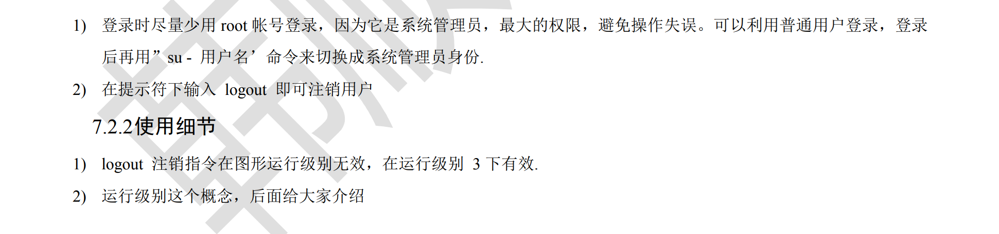

# 韩顺平网课

“怎么做，然后再知道为什么，适当地囫囵吞枣”

CentOS7


## 1. Linux 基础篇

### 1 虚拟机的相关操作

#### 1.1 虚拟机中网络连接的三种方式

-  桥接模式：虚拟系统可以和外部系统进行通信，虚拟机用的IP地址是和主机用的是一个网段的地址，容易造成IP冲突
- NAT（网络地址转换）模式：虚拟系统可以和外部系统进行通信，不造成IP冲突。是通过代理进行与外部网络进行通信的
- 主机模式：独立的系统，不与外界系统进行通讯

#### 1.1.2 虚拟机克隆

- 方法1：直接拷贝一份安装好的虚拟机文件。直接复制，然后用VMware打开.vmx文件
- 方法2：使用VMware的克隆操作
  - 注意：克隆时，需要先关闭Linux系统
  - 虚拟机—>管理—>克隆
  - 可以移植到其他电脑，用其他电脑的VMware打开

#### 1.3 虚拟机快照

 简而言之就是一种快速的系统备份与还原的功能, 就像时光机，可以倒退到某个点时系统状态，比如，当你装某个软件，或做某项测试时，如果把系统搞坏了，那么你可能就要重装系统以及装相当软件及配置,每次出问题,都要这样做，很费时间与精力，解决这个问题，可以在进行测试前先做一个快照，如果发生意外，只需要回到那个快照即可，不需要重头再装相关软件及配置。

要使用VMware的快照功能, 需要执行 "虚拟机"->"快照"->"拍摄快照"

快照也是占一定的空间的，所以不要无限地进行快照

#### 1.4 虚拟机的迁移删除

虚拟系统安装好之后，它的本质就是文件（放在文件夹中的）。因此虚拟系统的迁移是很方便的，你可以把安装好的虚拟系统整个文件夹拷贝或剪切到其他位置使用。删除也很简单，用VMware进行移除，或者点击菜单->从磁盘中删除将相关文件删除，或者直接手动删除虚拟系统对应的文件夹即可

#### 1.5 Linux_vmtools 建立共享文件夹

- windows 和 虚拟机的共享文件夹

  

  

**共享文件夹在Other Locations/computer/mnt/hgfs/**

- 涉及到共享文件夹hgfs权限的修改的[博客](https://blog.csdn.net/anlz729/article/details/106826215/?ops_request_misc=&request_id=&biz_id=102&utm_term=hgfs%20%E5%85%B1%E4%BA%AB%E6%96%87%E6%96%87%E4%BB%B6%E5%A4%B9%E4%BF%AE%E6%94%B9%E6%9D%83%E9%99%90&utm_medium=distribute.pc_search_result.none-task-blog-2~all~sobaiduweb~default-0-106826215.142^v68^control,201^v4^add_ask,213^v2^t3_esquery_v1&spm=1018.2226.3001.4187)

### 2 Linux

#### 2.1 Linux 目录结构

- Linux 的文件系统是采用级层式的**树状目录结构**，在此结构中的最上层是根目录 “/"，然后在此目录下再创建其他的目录

- 在 Linux 的世界中，一切皆文件

  


- Linux 目录结构

  

  

  

  

#### 2.2 远程登录到 Linux 服务器

- 正式上线的项目是运行在公网上的，因此程序员需要远程登录到 Linux 进行项目管理或者开发
- 工具
  - 远程登录的工具 Xshell
    - Xshell 是目前最好的远程登录到 Linux 操作的软件
    - 是强大的安全终端模拟软件，支持 SSH1，SSH2，以及Microsoft Windows 平台的 Telnet 协议
    - Xshell 可以在Windows 界面下用来访问远端不同系统下的服务器，从而比较好的到达远程控制终端的目的
    - 首先先下载并安装 Xshell 程序，有关主机与虚拟机如何ping通，参考[博客](https://blog.csdn.net/Zuoriqiufeng/article/details/124286026?ops_request_misc=%257B%2522request%255Fid%2522%253A%2522167195777916782429710214%2522%252C%2522scm%2522%253A%252220140713.130102334..%2522%257D&request_id=167195777916782429710214&biz_id=0&utm_medium=distribute.pc_search_result.none-task-blog-2~all~baidu_landing_v2~default-1-124286026-null-null.142^v68^control,201^v4^add_ask,213^v2^t3_esquery_v1&utm_term=%E4%B8%BB%E6%9C%BA%E6%97%A0%E6%B3%95%E4%B8%8E%E8%99%9A%E6%8B%9F%E6%9C%BAPing%E9%80%9A&spm=1018.2226.3001.4187) ，下面”主机“填的是在虚拟机终端使用ifconfig 得到的IP地址，设置好之后即可继续远程登录并操作Linux系统了
    - 
  - 文件上传的工具 Xftp：是一个基于Windows平台的功能强大的SFTP、FTP文件传输软件。使用了Xftp以后，Windows用户能安全地在UNX/Linux和Windows PC之间传输文件。
    - 下载并安装Xftp，然后进行配置。配置完成之后要点连接。对于乱码，在左上角：文件->当前会话属性->选项->编码 选择 UTF-8
    - 
    - 
    - 在这个界面即可进行两个系统文件的传输，既可以从Windows向Linux系统中传输文件，又可以从Linux系统向Linux系统中传输文件。非常地方便。

- 控制面板->网络和Internet->网络和共享中心->更改适配器设置->里面有VMware Network Adapter VMnet8和其他网络设置的适配器(禁用和启用)

#### 2.1 Vi 和Vim 编辑器

- Vi 和 Vim 的基本介绍

  Linux系统会内置vi文本编辑器
  Vim 具有程序编辑的能力，可以看做是ⅵ的增强版本，可以主动的以字体颜色辨别语法的正确性，方便程序设计。代码补完、编译及错误跳转等方便编程的功能特别丰富，在程序员中被广泛使用。

- Vi 和 Vim 常见的三种模式

  - 正常模式
    以 vim 打开一个档案就直接进入一般模式了（这是默认的模式）。在这个模式中，你可以使用 上下左右 按键来移动光标，你可以使用『删除字符」或「删除整行』来处理档案内容，也可以使用『复制、粘贴』来处理你的文件数据。
  - 插入模式
    按下 i I o O a A r R等任何一个字母之后才会进入编辑模式，一般来说按 i 即可

  - 命令行模式
    输入esc再输入：在这个模式当中，可以提供你相关指令，完成读取、存盘、替换、离开vim、显示行号等的动作则是在此模式中达成的！


- Vi 和 Vim 常用快捷键  [菜鸟Vim命令大全介绍]([Linux vi/vim | 菜鸟教程 (runoob.com)](https://www.runoob.com/linux/linux-vim.html))

  - （在一般模式下输入）拷贝当前行 yy，拷贝当前行向下5行 5yy，并粘贴输入p将复制的东西粘贴到当前行的下一行（而且这个粘贴是粘贴在当前光标的下一行，数字+p代表将该行代码粘贴几次）（在一般模式下输入）

  - P 则为贴在游标上一行！

  - 删除当前行 dd，删除当前行向下的5行 5dd（在一般模式下输入）

  - 在文件中查找某个单词：[命令行下：/关键字，回车进行查找，在正常模式下继续输入n就是查找下一个]（命令行模式下输入）

  - 设置文件的行号[命令行下：set nu]、取消文件的行号[命令行下：set nonu]

  - 定位到首行：gg、定位到末行：G(这两个命令都是在一般模式下输入)

  - 撤销：u(在一般模式下输入)（这个撤销是撤销的是刚刚一连串的动作）

  - 将光标快速定位到某一行：行号+shift+g（在一般模式下）

  - nG：n为数字，移动到这个档案的第n行

  - n<Enter>：n为数字，光标向下移动n行

  - o：增加当前行下一行(在一般模式下输入)

  - O：增加当前行上一行

  - 上下左右移动：

    - | 移动光标的方法     |                      |
      | :----------------- | -------------------- |
      | h 或 向左箭头键(←) | 光标向左移动一个字符 |
      | j 或 向下箭头键(↓) | 光标向下移动一个字符 |
      | k 或 向上箭头键(↑) | 光标向上移动一个字符 |
      | l 或 向右箭头键(→) | 光标向右移动一个字符 |

    - 连续多次移动，如连续向下移动30行，在一般模式下输入“30j"的组合按键，即加上自己想要进行的次数，再按下动作即可
    - n + <space> :那个 n 表示『数字』，例如 20 。按下数字后再按空格键，光标会向右移动这一行的 n 个字符。例如 20<space> 则光标会向后面移动 20 个字符距离。

  - 0：这是数字『 0 』：移动到这一行的最前面字符处 (常用)
  - $：移动到这一行的最后面字符处(常用)

  - x,X：在一行字当中，x 为向后删除一个字符 (相当于 [del] 按键)， X 为向前删除一个字符(相当于 [backspace] 亦即是退格键) (常用)
  - [Ctrl]+r：重复上一个动作

  ​    

  

#### 2.3 关机和重启命令


sync：把内存的数据同步到磁盘中

#### 2.4 用户登录和注销



- 平常的 su - 也就等于 su - root 进入root 用户权限。这个过程就是从普通用户切换到root 用户，回到普通用户 logout 或者 exit 或者 su - 用户名

#### 2.5 用户管理

Linux 系统是一个多用户多任务的操作系统，任何一个要使用系统资源的用户，都必须首先向系统管理员申请一个账号，然后以这个账号的身份进入系统

- 一个Linux 系统只能有一个 root 用户，然后在这个root 用户下可以创建多个用户，每一个用户都对应着一个目录
- 添加用户：
  - 基本语法：useradd 用户名
  - 案例：添加一个用户 milan，默认该家目录在/home/milan
  - 说明：当创建用户成功后，会自动的创建和用户同名的家目录。
  - 也可以通过 user -d 指定目录 新的用户名, 给新创建的用户指定家目录
  - 创建完用户之后要给用户设置密码：passwd 用户名（便于登录）

- 删除用户：userdel 用户名（用户删除是 root 用户的权限）
  - 保留家目录：userdel 用户名
  - 删除用户以及家目录：userdel -r 用户名
  - 一般建议将用户的家目录保留

- 查询用户信息指令：
  - 基本语法：id 用户名
  - 显示 uid 组id 所在组

- 切换用户：su - 用户名
  - 说明：从权限高的用户切换到权限低的用户不需要密码，反之是需要的。当需要返回到原来用户时，使用exit/logout

- 查看当前用户/登录用户：whoami / who am I

- 用户组：

  - 类似于一种角色，系统可以对有共性/权限的多个用户进行统一的管理

  - 新增组指令：groupadd 组名

  - 删除组名：groupdel 组名

  - 添加用户直接加上组：useradd -g 用户组 用户名（这条命令的前提是 用户组 已经之前建立好了）

  - 对于建立用户时未指定组的，会默认组名就是用户名本身

  - 修改用户的组：usermod -g 用户组 用户名

  - Linux中一切皆文件——用户和组相关文件

    - Shell 就像是一个翻译官，将命令翻译给Linux内核
    - Shell有很多种类，bash,fcsh,csh等等

    

    


# 自己的

## 1. 设置相关

### 1.1 虚拟机字体以及图标大小的修改

- 安装**Gnome Tweaks**桌面配置文件

  安装gnome-tweaks桌面配置软件

  ```undefined
  sudo apt install gnome-tweaks
  ```

  可以在终端中选择打开这个软件，也可以在 Show Applications 中找到这个软件将其打开进行字体大小的调节

  

- 桌面图标大小调节

  参考于这个博客[桌面图标修改](https://blog.csdn.net/MrLoading/article/details/116096441)

- 文件夹中图标大小的调节(这个设置不仅仅可以调节图标的大小，还涉及其他的设置调整)

  

### 1.2 终端相关

- 快捷方式打开终端：ctrl + alt + T

- 如何设置终端的字体的大小：

  - 在终端中右键或者点击右上角三个横线 -> 选择 **Preferences** -> 选择 Unnamed -> 选择 Custom font -> 点击 Monospace Regular 进行字体样式以及大小设置

  - 如图：

    

### 1.3 超级用户相关

刚安装好虚拟机的时候，想切换到超级用户输入密码的时候，可能会提示：“Authentication failure”。此时，有两种情况：一个是真的是密码错了，另一种就是刚安装好的Linux系统，没有给root设置密码。

对于没有设置过 root 命令的，可以通过如下方式解决：

- 1 给 root 用户设置密码：

  命令：sudo passwd root

  输入密码，并确认密码。

- 2 重新输入命令：su root

  然后输入密码

  发现可以切换到 root 权限了

- 3 su xyx 命令，切换到普通命令（这个 xyx 指的是普通的用户的名字）

## 2 常用快捷键及常用命令

- 终端中按 tab 键自动补全
- reset：将终端中显示的命令全部清除
- pwd：显示所在的当前目录

