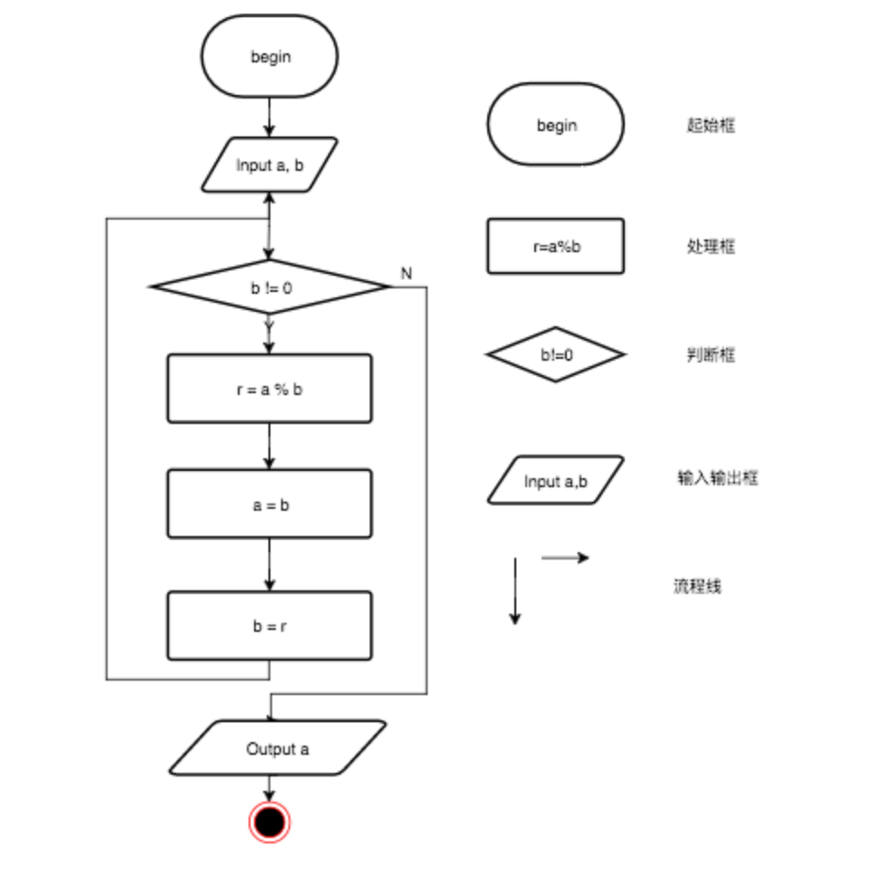
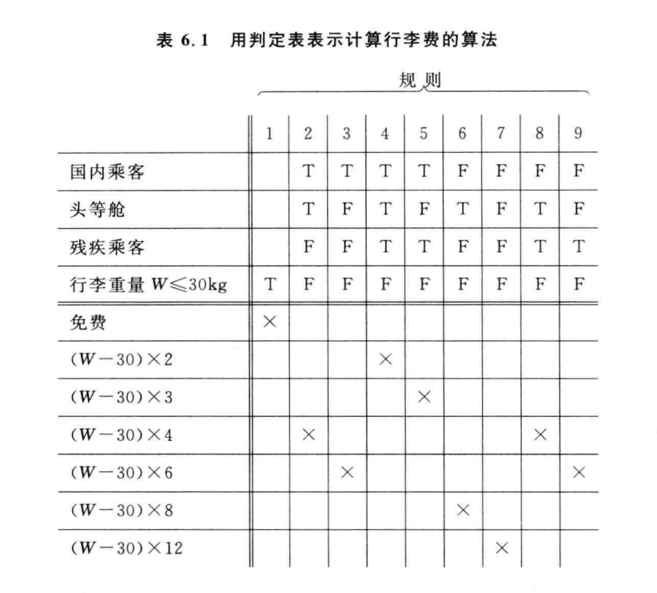
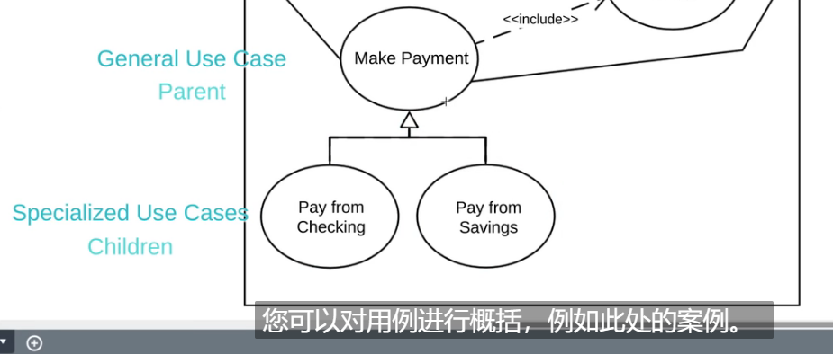

# 软工复习！冲冲！:smile:

## 1 书上的划重点

黄色的是ly标记的，是往年喜欢考的。蓝色的是今年csb的大部分

### 1.1 题型

#### 1.1.1 小题

- 选择题25‘，一个一分
- 判断题15’，一个一分

#### 1.1.2 画图题

- 详细设计中的pad图/盒图与流程图的转换、判定树判定表、黑盒白盒测试——20‘
- 用例图——9’
- 盒图——10‘
- 事件跟踪图—— 6’
- 数据流程图 ——15‘     

## 2 第六章 详细设计

### 2.1 一些定义

- 什么是结构程序设计：如果一个程序的代码块仅仅通过顺序、选择和循环这三种基本结构进行连接，并且每个代码块只有一个入口和出口，则称这个程序是**结构化的**

### 2.2 过程设计中的工具

描述程序处理过程的工具称为过程设计的工具

过程设计应该在数据设计、体系结构设计和接口设计完成之后进行，它的任务是设计解题的详细步骤（即算法），它是详细设计阶段应完成的主要工作

#### 2.2.1 程序流程图

- 程序流程图又称框图

表示：

- 圆框代表开始或结束
- 平行四边形输入或输出
- 菱形◇是if判断
- 矩形是执行语句

while和until也是通过这些图形实现。while是先判断在执行，until是先执行再判断

下图是一个简单的流程图，描述求两个数的最大公约数的算法（辗转相除法）：

- 缺点：
  - 程序流程图本质上不是精益求精的好工具，它诱使程序员过早地考虑程序的控制流程，而不去考虑程序的全局结构
  - 程序流程图中箭头代表控制流，因此程序员不受任何约束，可以完全不够结构程序设计的精神，随意转移控制
  - 程序流程图不易表示数据结构

#### 2.2.2 盒图(考画图)

又称N-S图

特点：

- 功能域（即一个特定控制结构的作用域）明确，可以从盒中一眼就看出来
- 不可能任意转移控制
- 很容易确定局部和全程数据的作用域
- 很容易表现嵌套关系，也可以表示模块的层次结构

do-while任然是先判断后执行

do-until是先执行后判断

输入三角形三边长，判断三遍构成的是等边，等腰，还是一般三角形：

#### 2.2.3 PAD图(考画图)

PAD问题分析图Problem analysis diagram，用二维树形结构的图来表示程序的控制流，将这种图翻译成程序代码比较容易。PAD图转化成与之对应的高级语言程序比较容易

PAD图的优点：

- 使用表示结构化控制结构的PAD符号所设计出来的程序必然是结构化程序
- PAD图所描述的程序结构十分清晰
- 用PAD图表现程序逻辑、易读、易懂、易记
- 容易将PAD图转换为高级语言源程序
- 即可用于表示程序逻辑，也可用于描述数据结构
- PAD图的符号支持自顶向上、逐步求精方法的使用

#### 2.2.4 判定表(考画图)

判定表右下部分中画×表示左边的那项动作，空白表表示不做这项动作

#### 2.2.5 判定树

判定树是判定表的变种，它也能清晰地表示复杂的条件组合与应做的动作之间的对应关系

## 3 第八章 维护

软件维护需要的工作量很大

### 3.1 软件维护的定义和分类

所谓软件维护就是在软件**已经交付使用之后，**为了改正错误或满足新的需要而修改软件的过程

- 改正性维护：把诊断和改正错误的过程
- 适应性维护：为了和变化了的环境适当地配合而进行的修改软件的活动，是既必要又经常的维护活动
- 完善性维护：在使用软件的过程中用户往往提出增加新功能或修改已有功能的建议，还可能提出一般性的改进意见。**占比最高**
- 预防性维护：为了改进未来的可维护性或可靠性，或为了未来的改进奠定更好的基础而修改软件

### 3.2 软件的可维护性

决定软件可维护性的因素：

- 可理解性
- 可测试性
- 可修改性
- 可移植性
- 可重用性

## 4 第五章 总体设计

总体设计又称为概要设计或初步设计

总体设计阶段的另一项重要任务是设计软件的结构，也就是要确定系统中每个程序是由哪些模块组成的，以及这些模块相互间的关系

### 4.1 设计过程

总体设计过程通常由两个主要的阶段组成：系统设计阶段，确定系统的具体实现方案；结构设计阶段，确定软件结构

结构设计的功能分解：首先进行结构设计，然后进行过程设计。结构设计确定程序由哪些模块组成，以及这些模块之间的关系；过程设计确定每个模块的处理过程。结构设计是总体设计阶段的任务，过程设计是详细设计阶段的任务

### 4.2 设计原理(耦合内聚)

- 模块化

  

- 抽象

  

- 逐步求精

  

  

- 信息隐藏和局部化

  

- 模块独立(耦合和内聚)

  模块的独立程度可以由两个定性标准度量，这两个标准分别称为内聚和耦合

  - 耦合：耦合是对一个软件结构内不同模块之间互连程度的度量

    尽量使用数据耦合，少用控制耦合和特征耦合，限制公共环境耦合的范围，完全不用内容耦合

    - 数据耦合：如果两个模块彼此之间通过参数交换信息，而且交换的信息仅仅是数据

    - 控制耦合：如果传递的信息中有控制信息（尽管有时这种控制信息以数据的形式出现）

      数据耦合是低耦合，控制耦合是中等程度的耦合

    - 特征耦合：把整个数据结构作为参数传递而被调用的模块**只需要使用其中一部分数据元素时，就出现了特征耦合**

    - 公共环境耦合：当两个或多个模块通过一个公共数据环境相互作用时

      

    - 内容耦合：是最高程度的耦合

      

      

  - 内聚：标志着一个模块内各个元素彼此结合的紧密程度，它是信息隐藏和局部化概念的自然扩展。理想内聚的模块只做一件事情

    低内聚：

    - 偶然内聚：如果一个模块完成一组任务，这些任务彼此即使有关系，关系也是很松散的
    - 逻辑内聚：如果一个模块完成的任务在逻辑上数据相同或相似的一类

    中内聚：

    - 过程内聚：如果一个模块内的处理元素时相关的，而且必须以特定次序执行
    - 通信内聚：如果模块中的所有元素都使用同一个输入数据和（或）产生同一个输出数据

    高内聚：

    - 如果一个模块内的处理元素和同一功能密切相关，而且这些处理必须顺序执行（通常一个处理元素的输出数据作为下一个处理元素的输入数据）

    - 功能内聚：如果模块内所有处理元素属于一个整体，完成一个单一的功能。最高的内聚

      

### 4.3 启发规则

启发式规则：

- 改进软件结构提高模块独立性

- 模块规模应该适中

- 深度、宽度、扇出、扇入都应适当

  深度：软件结构中控制的层数

  宽度：软件结构内同一层次上的模块总数的最大值

  扇出：调用别的模块

  扇入：被其他模块调用

  

- 模块的作用域应该在控制域之内

  

- 力争降低模块接口的复杂程度
- 设计单入口单出口的模块
- 模块功能应该可以预测

### 4.4 描绘软件结构的图形工具

#### 4.4.1 层次图

层次图用来描绘软件的层次结构。层次图中的一个矩形框代表一个模块，方框间的连线表示调用关系

自顶向下

#### 4.4.2 结构图

## 5 第七章 实现

通常把编码和测试统称为实现

- 编码就是把软件设计结果翻译成用某种程序设计语言书写的程序，编码是对设计的进一步具体化
- 软件测试在软件生命周期中横跨两个阶段。
  - 通常在编写出每个模块之后就对它做必要的测试，称为单元测试，模块的编写者和测试者是同一个人，编码和单元测试属于软件生命周期的同一个阶段
  - 之后，还要对软件系统进行各种**综合测试**，这是软件生命周期中的另一个独立的阶段，通常由专门的测试人员承担这项工作

### 7.1 软件测试的目标

软件测试的目标或定义：

1. 测试是为了发现程序中的错误而执行程序的过程
2. 好的测试方案是极可能发现迄今为止尚未发现的错误的测试方案
3. 成功的测试是发现了至今为止尚未发现的错误的测试

所以测试是为了发现程序中错误而执行程序的过程。测试决不能证明程序是正确的

### 7.2 软件测试准则

- 所有测试都应该能追溯到用户需求
- 应在远在测试开始之前就制定出测试计划
- Pareto原理说明，测试发现的错误中的80%很可能由程序的20%的模块造成的
- 应该从小规模测试开始，并逐步进行大规模测试
- 穷举测试是不可能的。所以，测试只能证明程序中有错误，不能证明程序中没有错误

- 测试应该由第三方从事测试工作。开发软件工程师并不是完成全部测试工作的最佳的人选

### 7.3 测试方法和步骤

黑盒测试法：把程序当成一个黑盒子，完全不考虑程序内部结构和处理过程，只检查程序功能是否能按照规格说明书的规定正常使用，又称为功能测试

白盒测试法：与黑盒测试法相反，它的前提是可以把程序看成装在一个透明的白盒子里，测试者完全知道程序的结构和处理算法。这种方法是按照程序内部的逻辑测试程序，检测程序中的主要执行通道是否都能按预定要求工作，又称为结构测试

-----

测试步骤：

- 模块测试：目的是保证每个模块作为一个单元能正确运行，所以模块测试又称为单元测试，在这个测试中所发现的往往是编码和详细设计中的错误

- 子系统测试：是把经过单元测试的模块放在一起形成一个子系统来测试。模块相互间协调和通信是这个测试过程中的主要问题，因此这个步骤着重测试模块的接口

- 系统测试：把经过测试的子系统装配成一个完整的系统来测试。在这个过程中不仅应该发现设计和编码的错误，还应该验证系统确实能提供需求说明书中指定的功能，而且系统的动态特性也符合预定要求。这个过程往往发现软件设计中的错误，也可能发现需求说明中的错误

- 验收测试：也称为确定测试，主要验证系统确实满足用户的需求

  

- 平行运行：验收之后，要再经过一段平行运行时间的考研

  

测试阶段的信息流：

- 软件配置，包括需求说明书、设计说明书和源程序清单等

- 测试配置：包括测试计划和测试方案

  

边界条件：边界测试是单元测试中最后的也是最重要的任务

### 7.4 集成测试

集成测试是测试和组装软件的系统化技术

由模块组装成程序时有两种办法：

目前在进行集成测试时普遍采用渐增式测试方法。渐增方式有自顶向下和自顶向上两种集成策略

- 自顶向下集成

  

- 自底向上集成

  

  

不同集成测试策略的比较：

### 7.5 确定测试

确定测试也称为验收测试，它的目标是验证软件的有效性

验证指的是保证软件正确地实现了某个特定要求的一系列活动；确定指的是为了保证软件确实满足了用户需求而进行的一系列活动。

需求分析阶段产生的软件需求规格说明书，准确地描述了用户对软件的合理期望，因此是软件有效性的标准，也是进行确认测试的基础

#### 7.5.1 Alpha和Beta测试

Alpha测试是在开发者的场所进行，并在开发者对用户的“指导”下进行测试

Beta测试用户们在一个或多个客户场所进行，开发者不在场

### 7.6 白盒测试技术

逻辑覆盖：

- 语句覆盖：程序中的每个语句应该都至少执行一遍
- 判定覆盖：不仅每个语句必须至少执行一遍，而且每个判断的每种可能的结果都应该至少执行一次。也就是每个判断的每个分支都至少执行一遍

- 条件覆盖：不仅每个语句至少执行一遍，而且使判定表达式中每个条件都取到各种的结果
- 判定/条件覆盖：判定覆盖不一定包含条件覆盖，条件覆盖也不一定包含判定覆盖，判定/条件覆盖同时满足这两种覆盖标准
- 条件组合覆盖：使得每个判定表达式中条件的各种可能组合都至少出现一次。条件组合覆盖是前述几种覆盖标准最强的，满足条件组合覆盖标准的测试数据，也一定满足判定覆盖、条件覆盖/条件覆盖。但满足条件组合覆盖标准的测试数据不一定能使程序中的每条路径都能执行到

---------------------------------------------

- 路径覆盖Path Coverage：要把每一条路的每一种组合都走一遍

  

- 多重条件覆盖/组合覆盖 combinatory coverage：每个判断中的每个子句的组合都要覆盖

  使用最少的测试用例满足所有的条件

  

  

- 条件覆盖 clause coverage，每个判断中的每个子句的不同true false都要取一遍

  

- 判断覆盖branch coverage：能够在每个判断去至少一个T和至少一个F的测试用例覆盖。只需要每个判断跑一次T和F即可

  

- 语句覆盖statement coverage

-----------------------------------

- 点覆盖：使得程序执行路径至少经过流图的每个结点一次，由于流图的每个结点与一条或多条语句相对应，显然**点覆盖标准和语句覆盖标准是相同的**

- 边覆盖：要求选取足够多测试数据，使得程序执行路径至少经过流图中每条边一次。通常边覆盖和**判定覆盖是一致的**
- 路径覆盖：选取足够多的测试数据，使程序的每条路径都至少执行一次

基本路径测试是一种白盒测试技术

### 7.7 黑盒测试

黑盒测试着重测试软件功能，黑盒测试不能取代白盒测试，它与白盒测试互补。白盒测试在测试过程的早期阶段进行，而黑盒测试主要用于测试过程后期

等价划分：是一种黑盒测试技术，这种技术把程序输入域划分成若干数据类，据此导出测试用例

边界值分析：选取的测试数据应该刚好等于、刚刚小于、刚刚大于边界值。也就是说，按照边界值分析法，应该选取刚好等于、稍小于、稍大于等价类边界值数据作为测试数据，而不是选择每个等价类内的典型值或任意值作为测试数据

有效等价类使用一个用例即可，因为它覆盖了所有的有效等价类。举的用例不能相同

题目：

- 写等价划分表

  

- 设计测试用例表

  

### 7.8 调试

调试也称为纠错，其作为成功测试的后果出现，也就是说，调试是在测试发现错误之后排除错误的过程

调试工程总会有以下两种结果之一：

- 找到了问题的原因并把问题改正和排除掉了
- 没找到问题的原因

调试途径：

- 蛮干法

  

- 回溯法

  

- 原因排除法：对分查找法、归纳法、演绎法

  

软件可靠性：是程序在给定时间间隔内，按照规格说明书的规定成功地运行的概率。可靠性随着给定的时间间隔的加大而减少

软件可用性：程序在给定的时间点，按照规格说明书的规定，成功运行的概率。

## 6 第一章 软件工程学概述

- 软件危机：
  - 软件危机是什么
  - 软件危机的典型表现
  - 产生软件危机的原因
  - 消除软件危机的途径

- 软件工程：
  软件工程是指导计算机软件开发和维护的一门工科学科
  - 软件工程的本质特征
  - 软件工程基本原理
  - 软件工程方法学：
    - 传统方法学或结构化范型，采用结构化技术来完成软件开发的各项任务
    - 面向对象方法学，把数据和行为看成同等重要，即面向数据又面向行为

- 软件的生命周期：软件定义、软件开发、运行维护三个时期组成
  - 三个时期的进一步划分

- 软件过程：通常使用生命周期模型简洁地描述软件过程。生命周期模型规定了把生命周期划分成哪些阶段以及各个阶段的执行顺序，因此又被称为过程模型

  典型的软件过程模型：

  - 瀑布模型：每个阶段都必须有规定的文档，文档驱动的

  - 快速原型模型：不带反馈环，线性顺序进行的。原型的目的就是获知用户的真正需求，一旦需求确定了原型将会被抛弃

  - 增量模型：分批次地逐步交付给用户，整个软件产品被分解成许多个增量构建

  - 螺旋模型：使用原型以及其他方法来尽量降低风险，风险驱动的

  - 喷泉模型：典型的面向对象的软件过程模型

  - RUP统一过程：将软件生命周期划分成4个连续的阶段

  - 敏感过程：敏感软件开发宣言，4个简单的价值观声明

    极限编程：把好的开发实践运用到极致

## 7 第二章 可行性研究

可行性研究的目的就是用最小的代价在尽可能短的时间来确定问题是否能够解决。所以可行性研究的目的不是解决问题，而是确定问题是否值得去解决

技术可行性、经济可行性、操作可行性

- 可行性研究过程：
  - 复查系统规模和目标
  - 研究目前正在使用的系统
  - 导出新系统的高层逻辑模型
  - 进一步定义问题
  - 导出和评价供选择的解法
  - 推荐行动方针
  - 草拟开发计划
  - 书写文档提交审查

- 系统流程图：概括描述物理系统的传统工具，表达的是**数据在系统各部件之间流动的情况**，而不是对数据进行加工处理的控制过程
- **数据流图：**描述数据在软件中流动和被处理的逻辑过程
- 数据字典：是关于数据的信息的集合，也就是对数据流图中包含的所有元素的定义的集合

## 8 第三章 需求分析

需求分析是软件定义时期的最后一个阶段，它的基本任务是准确地回答“系统必须做什么”这个问题

在需求分析阶段结束之前，系统分析员应该写出软件需求规格说明书

需求分析的任务：

- 功能需求
- 性能需求
- 可靠性和可用性需求
- 出错处理需求
- 接口需求
- 约束
- 逆向需求：说明软件系统不应该做什么
- 将来可能提出的要求

实体联系图即ER图：实体、属性、关系

状态装换图（状态图）

- 初状用实心圆表示，终态用一对同心圆（内圆为实心圆）表示
- 中间状态时圆角矩形
  - 状态
  - 状态变量
  - 活动表
- 事件：在表示状态转换的箭头线上标出触发转换的事件表达式；如果箭头线上未标明事件，则表示在源状态的内部活动执行完之后自动触发转换
  - 事件表达式：事件说明[守卫条件]/动作表达式
  - 守卫条件是一个布尔表达式

验证软件需求的方法：从一致性、完整性、现实性、有效性这四个角度验证软件需求的正确性

## 9 第九章 面向对象方法学引论

- 面向对象方法学的要点：

  面向对象方法学的出发点和基本原则，是尽可能模拟人类习惯的思维方式，使开发软件的方法与过程尽可能接近人类认识世界解决问题的方法与过程，也就是描述问题的问题空间（问题域）和实现解决的解空间（求解域）在结构上尽可能一致

  客观世界由对象组成

- 软件系统本质上是信息处理系统

- 只有同时使用对象、类、继承和消息的方法，才是真正面向对象的方法

- 传统的软件开发方法可以用“瀑布”模型来描述，这种方法强调自顶向下按部就班地完成软件开发工作；面向对象方法学的基本原则是按照人类习惯的思维方法建立问题域的模型，开发出尽可能直观、自然地表现求解方法的软件系统

  面向对象方法学的优点：

  - 与人类习惯的思维方法一致
  - 稳定性好
  - 可重用性好
  - 较易开发大型软件产品
  - 可维护性好

### 9.1 面向对象建模

- 描述系统数据结构的对象模型

- 描述系统控制结构的动态模型

  表示瞬时的、行为化的系统的“控制”性质，它规定了对象模型中的对象的合法化序列

- 描述系统功能的功能模型，指明了系统应该做什么

#### 9.1.1 对象模型

对象模型表示静态的、结构化的系统的“数据性质”。它是对模拟客观世界实体的对象以及对象彼此间的关系的映射，描述系统的静态结构

UML：统一建模语言。通常使用UML提供的类图来建立对象模型

通常，使用UML提供的**类图**来建立对象模型

属性或方法的可见性用于设置给属性或方法的可访问性

[【有翻译】10 分钟学会 UML 类图（UML Class Diagram Tutorial）_哔哩哔哩_bilibili](https://www.bilibili.com/video/BV1P741127u7/?spm_id_from=333.337.search-card.all.click&vd_source=8118f92da6fddd1314c7a349e5a58084)

- -负号代表访问性为private
- +加号代表访问性为public
- #代表方位性为protected
- ~  package/default: which means it can be used by any other class; 

继承用三角形

聚集：

- 共享聚集：对象可以同时参与多个处于整体对象的构成，直线末端紧挨着整体类的地方画一个空心菱形

- 组合聚集：脱离了整体将不复存在。组成关系用实心菱形表示

  

  

#### 9.1.2 功能模型

UML提供的用例图也是进行需求分析和建立功能模型的强有力工具。在UML中把用用例图建立起来的系统模型称为用例模型

一幅用例图包含模型元素有系统、行为者、用例及用例之间的关系

[【有翻译】10 分钟学会 UML 类图（UML Class Diagram Tutorial）_哔哩哔哩_bilibili](https://www.bilibili.com/video/BV1P741127u7/?spm_id_from=333.337.search-card.all.click&vd_source=8118f92da6fddd1314c7a349e5a58084)

- Relationships

  - Association：就是普通的联系，直接用直线表示即可

  - include：

    

    

  - extend：

    

    

    

  - generalization：

    

    

## 10 第十章 面向对象分析

面向对象分析（OOA）的关键是识别出问题域内的类和对象，并分析它们相互间的关系，最终建立起问题域的简单、精确、可理解的正确模型
